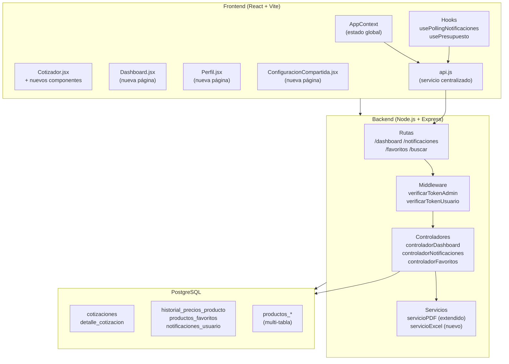

# Diseño Técnico — Features Avanzadas del Cotizador

## Resumen de investigación

Antes de escribir el diseño se analizó el código existente para garantizar coherencia con los patrones establecidos:

- **Backend**: Express + PostgreSQL con `ejecutarQuery` / `ejecutarTransaccion`. Middlewares `verificarTokenAdmin`, `verificarTokenUsuario`, `detectarUsuario`. Controladores en `backend/src/controladores/`, servicios en `backend/src/servicios/`, rutas en `backend/src/rutas/`.
- **Frontend**: React + Tailwind, contexto global en `AppContext.jsx`, servicios centralizados en `frontend/src/servicios/api.js`, hooks en `frontend/src/hooks/`. Rutas en `App.jsx` con `RutaProtegida` (admin) y `RutaProtegidaUsuario` (cualquier autenticado).
- **Base de datos**: Tablas `cotizaciones`, `detalle_cotizacion`, `usuarios_clientes`, `configuracion`. Esquema multi-tabla de productos (`productos_procesador`, `productos_placa_madre`, etc.). Función PostgreSQL `generar_codigo_ticket()`.
- **PDF**: `ServicioPDF` usa `@react-pdf/renderer` en producción y `pdfkit` en tests. Patrón de construcción de documento con `construirDocumentoCotizacion()`.
- **Testing**: `fast-check` ya instalado como devDependency en backend. Jest + Supertest para integración.
- **Librerías nuevas**: `xlsx` y `qrcode` en backend; `recharts` en frontend.

---

## Visión General

Este documento describe el diseño técnico para las 11 features avanzadas del Cotizador NSG. Las features se agrupan en cuatro capas:

1. **Analítica y reportes**: Dashboard de métricas (Req. 1), Exportar a Excel (Req. 2), Historial de precios (Req. 3).
2. **Personalización y social**: Favoritos (Req. 4), Notificaciones (Req. 5), Configuraciones compartidas (Req. 10).
3. **Experiencia de cotización**: Comparador de productos (Req. 6), Diagrama de compatibilidad (Req. 7), Búsqueda por compatibilidad (Req. 8), Validación de presupuesto (Req. 11).
4. **Documentación**: QR en PDF (Req. 9).

---

## Arquitectura

### Diagrama de alto nivel



### Principios de diseño

- **Sin cambios de contrato**: Los endpoints existentes no se modifican; solo se agregan nuevos o se extienden con parámetros opcionales.
- **Transacciones atómicas**: Operaciones que afectan múltiples tablas (historial de precios, notificaciones al crear cotización) se ejecutan dentro de `ejecutarTransaccion`.
- **Consistencia de patrones**: Nuevos controladores siguen el mismo patrón de `sanitizarObjeto` + consultas parametrizadas + respuestas `{ exito, ... }`.
- **Degradación elegante**: Funcionalidades opcionales (QR en PDF, notificaciones) no bloquean el flujo principal si fallan.

---

## Componentes e Interfaces

### Backend — Nuevos módulos

#### `backend/src/rutas/dashboard.js`
```
GET /api/dashboard/metricas  →  verificarTokenAdmin  →  controladorDashboard.obtenerMetricas
```

#### `backend/src/rutas/notificaciones.js`
```
GET  /api/notificaciones/pendientes      →  verificarTokenUsuario  →  obtenerPendientes
PATCH /api/notificaciones/:id/leer       →  verificarTokenUsuario  →  marcarLeida
```

#### `backend/src/rutas/favoritos.js`
```
GET    /api/productos/favoritos           →  verificarTokenUsuario  →  obtenerFavoritos
POST   /api/productos/favoritos           →  verificarTokenUsuario  →  agregarFavorito
DELETE /api/productos/favoritos/:idProd   →  verificarTokenUsuario  →  eliminarFavorito
```

#### Extensión de `backend/src/rutas/cotizaciones.js`
```
GET /api/cotizaciones/:codigoTicket/excel  →  verificarTokenUsuario  →  exportarExcel
```

#### Extensión de `backend/src/rutas/productos.js`
```
GET /api/productos/:id/historial-precios   →  verificarTokenAdmin  →  obtenerHistorialPrecios
GET /api/productos/buscar                  →  detectarUsuario      →  buscarProductos (extendido)
```

### Backend — Nuevos controladores

#### `controladorDashboard.obtenerMetricas(req, res)`
Consulta agregada única con múltiples CTEs:
```sql
WITH
  cotizaciones_hoy AS (
    SELECT COUNT(*) AS total, COALESCE(SUM(precio_total), 0) AS ingresos
    FROM cotizaciones
    WHERE DATE(fecha_emision) = CURRENT_DATE
      AND estado IN ('Pendiente', 'Completada')
  ),
  cotizaciones_semana AS (
    SELECT COUNT(*) AS total, COALESCE(SUM(precio_total), 0) AS ingresos
    FROM cotizaciones
    WHERE fecha_emision >= CURRENT_DATE - INTERVAL '7 days'
      AND estado IN ('Pendiente', 'Completada')
  ),
  productos_top AS (
    SELECT dc.nombre_producto, dc.categoria,
           COUNT(*) AS apariciones
    FROM detalle_cotizacion dc
    JOIN cotizaciones c ON c.id = dc.id_cotizacion
    WHERE c.fecha_emision >= CURRENT_DATE - INTERVAL '7 days'
    GROUP BY dc.nombre_producto, dc.categoria
    ORDER BY apariciones DESC
    LIMIT 5
  )
SELECT
  (SELECT row_to_json(cotizaciones_hoy) FROM cotizaciones_hoy) AS hoy,
  (SELECT row_to_json(cotizaciones_semana) FROM cotizaciones_semana) AS semana,
  (SELECT json_agg(productos_top) FROM productos_top) AS productos_top
```

#### `controladorNotificaciones`
- `obtenerPendientes`: `SELECT ... WHERE id_usuario = $1 AND leida = false ORDER BY fecha_creacion DESC`
- `marcarLeida`: `UPDATE notificaciones_usuario SET leida = true WHERE id = $1 AND id_usuario = $2`

#### `controladorFavoritos`
- `obtenerFavoritos`: JOIN con tabla de productos correspondiente usando `id_producto` y `tabla_producto`.
- `agregarFavorito`: INSERT con manejo de conflicto único `(id_usuario, id_producto)`.
- `eliminarFavorito`: DELETE con verificación de pertenencia al usuario.

#### `servicioExcel` (nuevo archivo)
```javascript
// backend/src/servicios/servicioExcel.js
const XLSX = require('xlsx');

function generarExcelCotizacion(cotizacion) {
  // Hoja 1: Metadatos
  // Hoja 2: Componentes
  // Retorna Buffer
}
```

### Frontend — Nuevos componentes

| Componente | Ruta de archivo | Descripción |
|---|---|---|
| `Dashboard` | `paginas/Dashboard.jsx` | Página `/admin/dashboard` con stat cards y gráfico |
| `Perfil` | `paginas/Perfil.jsx` | Página `/perfil` con favoritos del usuario |
| `ConfiguracionCompartida` | `paginas/ConfiguracionCompartida.jsx` | Página `/configuracion` que carga config desde URL |
| `PanelComparador` | `componentes/cotizador/PanelComparador.jsx` | Panel de comparación de hasta 3 productos |
| `DiagramaCompatibilidad` | `componentes/cotizador/DiagramaCompatibilidad.jsx` | SVG de nodos y conexiones de compatibilidad |
| `AnalizadorPresupuesto` | `componentes/cotizador/AnalizadorPresupuesto.jsx` | Input de presupuesto con análisis en tiempo real |
| `NotificacionToast` | `componentes/feedback/NotificacionToast.jsx` | Toast de notificación del sistema |
| `usePollingNotificaciones` | `hooks/usePollingNotificaciones.js` | Hook de polling cada 30s |
| `useComparador` | `hooks/useComparador.js` | Hook de estado del comparador (máx. 3 productos) |

### Frontend — Extensiones de `api.js`

```javascript
// Nuevas funciones a agregar en api.js
export const obtenerMetricasDashboard = async () => { ... }
export const exportarExcelCotizacion = async (codigoTicket) => { ... }  // responseType: 'blob'
export const obtenerHistorialPrecios = async (idProducto) => { ... }
export const obtenerFavoritos = async () => { ... }
export const agregarFavorito = async (idProducto) => { ... }
export const eliminarFavorito = async (idProducto) => { ... }
export const obtenerNotificacionesPendientes = async () => { ... }
export const marcarNotificacionLeida = async (idNotificacion) => { ... }
export const buscarProductosCompatibles = async (filtros) => { ... }
export const generarUrlConfiguracion = (configuracion) => { ... }  // función pura, sin API
export const decodificarConfiguracion = (base64) => { ... }        // función pura, sin API
```

---

## Modelos de Datos

### Nuevas tablas

#### `historial_precios_producto`
```sql
CREATE TABLE historial_precios_producto (
  id                  SERIAL PRIMARY KEY,
  id_producto         INTEGER NOT NULL,
  tabla_producto      VARCHAR(60) NOT NULL,
  precio_anterior     DECIMAL(12, 2) NOT NULL,
  precio_nuevo        DECIMAL(12, 2) NOT NULL,
  fecha_cambio        TIMESTAMPTZ NOT NULL DEFAULT NOW(),
  id_usuario_admin    INTEGER REFERENCES usuarios_admin(id) ON DELETE SET NULL
);

CREATE INDEX idx_historial_precios_id_producto
  ON historial_precios_producto (id_producto, tabla_producto);

CREATE INDEX idx_historial_precios_fecha
  ON historial_precios_producto (fecha_cambio DESC);
```

**Decisión de diseño**: Se incluye `tabla_producto` porque el catálogo es multi-tabla. Sin este campo, no se puede reconstruir el JOIN para obtener el nombre del producto.

#### `productos_favoritos`
```sql
CREATE TABLE productos_favoritos (
  id              SERIAL PRIMARY KEY,
  id_usuario      INTEGER NOT NULL REFERENCES usuarios_clientes(id) ON DELETE CASCADE,
  id_producto     INTEGER NOT NULL,
  tabla_producto  VARCHAR(60) NOT NULL,
  fecha_agregado  TIMESTAMPTZ NOT NULL DEFAULT NOW(),
  CONSTRAINT uq_favorito_usuario_producto UNIQUE (id_usuario, id_producto, tabla_producto)
);

CREATE INDEX idx_favoritos_usuario
  ON productos_favoritos (id_usuario);
```

**Decisión de diseño**: La constraint UNIQUE incluye `tabla_producto` para evitar colisiones de IDs entre tablas distintas (e.g., `productos_procesador.id=1` y `productos_ram.id=1` son productos diferentes).

#### `notificaciones_usuario`
```sql
CREATE TABLE notificaciones_usuario (
  id              SERIAL PRIMARY KEY,
  id_usuario      INTEGER NOT NULL REFERENCES usuarios_clientes(id) ON DELETE CASCADE,
  tipo            VARCHAR(50) NOT NULL,
  titulo          VARCHAR(200) NOT NULL,
  mensaje         TEXT NOT NULL,
  leida           BOOLEAN NOT NULL DEFAULT FALSE,
  fecha_creacion  TIMESTAMPTZ NOT NULL DEFAULT NOW(),
  datos_extra     JSONB
);

CREATE INDEX idx_notificaciones_usuario_pendientes
  ON notificaciones_usuario (id_usuario, leida, fecha_creacion DESC)
  WHERE leida = FALSE;
```

**Decisión de diseño**: Índice parcial `WHERE leida = FALSE` optimiza la consulta de pendientes que es la más frecuente (polling cada 30s).

### Modificaciones a tablas existentes

#### `controladorProductos.actualizarProducto` — integración de historial
La función existente `actualizarProducto` se modifica para insertar en `historial_precios_producto` dentro de la misma transacción cuando `precio_base` cambia:

```javascript
// Dentro de ejecutarTransaccion:
if (precioAnterior !== precioNuevo) {
  await cliente.query(
    `INSERT INTO historial_precios_producto
       (id_producto, tabla_producto, precio_anterior, precio_nuevo, id_usuario_admin)
     VALUES ($1, $2, $3, $4, $5)`,
    [id, tabla, precioAnterior, precioNuevo, req.usuario.id]
  );
}
```

### Migraciones SQL

Se crean tres scripts de migración independientes y verificables:

```
backend/scripts/migrar-features-avanzadas-01-historial-precios.js
backend/scripts/migrar-features-avanzadas-02-favoritos.js
backend/scripts/migrar-features-avanzadas-03-notificaciones.js
```

Cada script sigue el patrón de `migrar-finanzas-fase1.js`: `BEGIN` → DDL → `COMMIT`, con rollback en caso de error.

---

## Correctness Properties

*Una propiedad es una característica o comportamiento que debe mantenerse verdadero en todas las ejecuciones válidas del sistema — esencialmente, una declaración formal sobre lo que el sistema debe hacer. Las propiedades sirven como puente entre especificaciones legibles por humanos y garantías de corrección verificables por máquina.*

### Property 1: Conteo de cotizaciones por período es exacto

*Para cualquier* conjunto de cotizaciones con fechas de emisión aleatorias, el endpoint `GET /api/dashboard/metricas` debe retornar conteos que coincidan exactamente con el número de cotizaciones cuya `fecha_emision` cae dentro del período correspondiente (hoy / últimos 7 días).

**Validates: Requirements 1.2**

---

### Property 2: Ranking de productos más cotizados es correcto

*Para cualquier* distribución aleatoria de productos en cotizaciones, los 5 productos retornados por `GET /api/dashboard/metricas` deben ser exactamente los 5 con mayor frecuencia de aparición, ordenados de mayor a menor.

**Validates: Requirements 1.3**

---

### Property 3: Ingreso estimado es la suma correcta de cotizaciones activas

*Para cualquier* conjunto de cotizaciones con precios aleatorios y estados variados, el ingreso estimado retornado debe ser igual a la suma de `precio_total` de las cotizaciones en estado `Pendiente` o `Completada` dentro del período.

**Validates: Requirements 1.4**

---

### Property 4: Excel generado contiene todos los datos de la cotización

*Para cualquier* cotización con datos aleatorios (código ticket, componentes con nombres y precios arbitrarios, precio total), el archivo `.xlsx` generado debe contener todos los campos especificados: código ticket, fecha de emisión, fecha de validez, nombre de cada componente, categoría, precio unitario, cantidad y precio total.

**Validates: Requirements 2.2**

---

### Property 5: Formato inválido de ticket siempre retorna HTTP 400

*Para cualquier* string que no cumpla el patrón `NSG-YYYY-NNNN` (donde YYYY es un año de 4 dígitos y NNNN es un número de 4 dígitos), el endpoint `GET /api/cotizaciones/:codigoTicket/excel` debe retornar HTTP 400.

**Validates: Requirements 2.5**

---

### Property 6: Actualizar precio siempre crea registro en historial

*Para cualquier* producto con `precio_base` inicial y cualquier nuevo `precio_base` distinto, la operación `actualizarProducto` debe crear exactamente un nuevo registro en `historial_precios_producto` con `precio_anterior` igual al precio previo y `precio_nuevo` igual al precio actualizado, dentro de la misma transacción.

**Validates: Requirements 3.3**

---

### Property 7: Historial de precios está ordenado descendentemente

*Para cualquier* producto con N cambios de precio registrados en fechas aleatorias, el endpoint `GET /api/productos/:id/historial-precios` debe retornar los registros ordenados por `fecha_cambio` de más reciente a más antiguo.

**Validates: Requirements 3.5**

---

### Property 8: Round-trip de favoritos (agregar → consultar → eliminar)

*Para cualquier* usuario autenticado y cualquier producto válido:
- Después de `POST /api/productos/favoritos`, el producto debe aparecer en `GET /api/productos/favoritos`.
- Después de `DELETE /api/productos/favoritos/:id`, el producto no debe aparecer en `GET /api/productos/favoritos`.

**Validates: Requirements 4.3, 4.4, 4.6**

---

### Property 9: Crear cotización siempre genera notificación para usuario autenticado

*Para cualquier* cotización creada exitosamente por un usuario autenticado (rol `usuario`), debe existir exactamente una notificación de tipo `cotizacion_creada` en `notificaciones_usuario` con el `id_usuario` correcto y el `codigo_ticket` en `datos_extra`.

**Validates: Requirements 5.3**

---

### Property 10: Filtro de búsqueda por socket retorna solo productos compatibles

*Para cualquier* valor de `socket` (e.g., `LGA1700`, `AM5`, cualquier string), todos los productos retornados por `GET /api/productos/buscar?socket={valor}` deben tener su campo `socket` igual al valor del filtro.

**Validates: Requirements 8.2**

---

### Property 11: Filtros múltiples aplican AND lógico

*Para cualquier* combinación de parámetros de filtro (`socket`, `ram_tipo`), todos los productos retornados por `GET /api/productos/buscar` deben satisfacer simultáneamente todos los filtros aplicados.

**Validates: Requirements 8.3, 8.4**

---

### Property 12: QR codifica la URL de validación correcta

*Para cualquier* código ticket válido, el código QR generado por `ServicioPDF` debe decodificarse a la URL `{BASE_URL}/validar?ticket={codigoTicket}`.

**Validates: Requirements 9.2**

---

### Property 13: Round-trip de configuración compartida (codificar → decodificar)

*Para cualquier* configuración de componentes (objeto con IDs de productos por categoría), codificar en base64 y decodificar debe producir una configuración equivalente a la original.

**Validates: Requirements 10.2, 10.5, 10.8**

---

### Property 14: URL de configuración es determinista

*Para cualquier* configuración de componentes, llamar a `generarUrlConfiguracion` dos veces con la misma entrada debe producir exactamente la misma URL.

**Validates: Requirements 10.8**

---

### Property 15: Análisis de presupuesto es correcto para cualquier par (presupuesto, precio_total)

*Para cualquier* valor de presupuesto positivo y cualquier precio total positivo:
- Si `precio_total > presupuesto`: el exceso calculado debe ser `precio_total - presupuesto` y el estado debe ser `excedido`.
- Si `precio_total <= presupuesto`: el exceso debe ser `0` y el estado debe ser `dentro`.

**Validates: Requirements 11.2, 11.3, 11.4**

---

### Property 16: Recomendaciones de ahorro están ordenadas por costo descendente

*Para cualquier* configuración con precio total que supera el presupuesto, las recomendaciones de ahorro deben listar los componentes ordenados por `precio_base` de mayor a menor.

**Validates: Requirements 11.5**

---

## Manejo de Errores

### Estrategia general

Todos los nuevos endpoints siguen el formato de error estandarizado existente:

```json
{
  "error": "Descripción técnica del error",
  "mensaje": "Mensaje legible para el usuario",
  "codigo": "CODIGO_ERROR_CONSTANTE"
}
```

### Tabla de errores por feature

| Feature | Condición | HTTP | Código |
|---|---|---|---|
| Dashboard | Sin token o token no-admin | 401/403 | `NO_AUTORIZADO` / `ACCESO_RESTRINGIDO` |
| Excel | Ticket no encontrado | 404 | `COTIZACION_NO_ENCONTRADA` |
| Excel | Formato de ticket inválido | 400 | `CODIGO_INVALIDO` |
| Historial precios | Producto no encontrado | 404 | `PRODUCTO_NO_ENCONTRADO` |
| Favoritos | Producto ya en favoritos | 409 | `FAVORITO_DUPLICADO` |
| Favoritos | Favorito no encontrado | 404 | `FAVORITO_NO_ENCONTRADO` |
| Notificaciones | Notificación no encontrada o de otro usuario | 404 | `NOTIFICACION_NO_ENCONTRADA` |
| Búsqueda | Parámetros inválidos | 400 | `PARAMETROS_INVALIDOS` |
| QR en PDF | Fallo de generación QR | — | Log en consola, PDF sin QR |
| Config compartida | Base64 inválido | — | Redirect a `/cotizador` con mensaje |
| Config compartida | Producto no existe | — | Carga parcial con aviso al usuario |

### Degradación elegante

- **QR en PDF** (Req. 9.5): Si `qrcode.toDataURL()` lanza excepción, el PDF se genera sin el QR. El error se registra con `console.error('[ServicioPDF] Error al generar QR:', error)`.
- **Polling de notificaciones** (Req. 5.12): Si el endpoint retorna error, `usePollingNotificaciones` registra el error en consola y continúa el ciclo de polling sin interrumpir la UI.
- **Configuración compartida** (Req. 10.7): Si algunos productos del link ya no existen, se cargan los disponibles y se muestra un toast informativo con los nombres de los productos no encontrados.

---

## Estrategia de Testing

### Enfoque dual

Se usa una combinación de tests unitarios/integración con ejemplos concretos y tests de propiedades con `fast-check` (ya instalado en el proyecto).

### Tests de propiedades (fast-check)

Cada propiedad del documento se implementa como un test de `fast-check` con mínimo 100 iteraciones. Los tests de backend usan mocks de la base de datos para mantener velocidad y determinismo.

**Configuración de fast-check**:
```javascript
// Mínimo 100 iteraciones por propiedad
fc.assert(fc.property(...), { numRuns: 100 });
```

**Formato de tag en cada test**:
```javascript
// Feature: cotizador-features-avanzadas, Property N: <texto de la propiedad>
```

**Archivo de tests de propiedades**:
```
backend/src/__tests__/propiedades/
  dashboard.property.test.js       → Properties 1, 2, 3
  excel.property.test.js           → Properties 4, 5
  historialPrecios.property.test.js → Properties 6, 7
  favoritos.property.test.js       → Property 8
  notificaciones.property.test.js  → Property 9
  busqueda.property.test.js        → Properties 10, 11
  qr.property.test.js              → Property 12
  configuracionCompartida.property.test.js → Properties 13, 14
  presupuesto.property.test.js     → Properties 15, 16
```

### Tests de integración (Jest + Supertest)

```
backend/src/__tests__/integracion/
  dashboard.test.js          → Smoke: auth, endpoint existe
  excel.test.js              → Smoke: headers, Content-Type
  historialPrecios.test.js   → Smoke: esquema de tabla, índices
  favoritos.test.js          → Smoke: endpoints, unicidad
  notificaciones.test.js     → Smoke: endpoints, polling
  busqueda.test.js           → Smoke: parámetros de filtro
```

### Tests de componentes (Vitest + Testing Library)

```
frontend/src/__tests__/
  AnalizadorPresupuesto.test.jsx   → Lógica de comparación, estados
  PanelComparador.test.jsx         → Límite de 3 productos, accesibilidad
  DiagramaCompatibilidad.test.jsx  → Renderizado de nodos, colores
  NotificacionToast.test.jsx       → Animación, cierre automático
  usePollingNotificaciones.test.js → Inicio/parada del polling
  configuracionCompartida.test.js  → Round-trip base64
```

### Cobertura esperada

| Área | Tipo de test | Cobertura objetivo |
|---|---|---|
| Lógica de negocio backend | Propiedades (fast-check) | Todas las Properties 1-16 |
| Endpoints nuevos | Integración (Supertest) | Caso feliz + errores principales |
| Componentes UI | Componente (Vitest) | Caso feliz + estados de error/vacío |
| Migraciones SQL | Smoke (script de verificación) | Existencia de tablas e índices |

### Notas sobre PBT y mocks

Los tests de propiedades que involucran base de datos usan mocks de `ejecutarQuery` y `ejecutarTransaccion` para:
1. Mantener velocidad (100+ iteraciones sin I/O real).
2. Garantizar determinismo (sin dependencia de estado de BD).
3. Aislar la lógica de negocio de la infraestructura.

Los tests de integración con Supertest usan la base de datos de test (`NODE_ENV=test`, `.env.test`).
