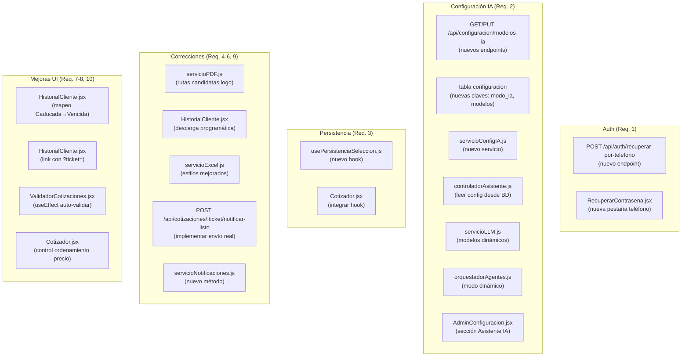

# Diseño Técnico — Mejoras del Sistema Cotizador

## Resumen de investigación

Antes de escribir este diseño se analizó el código existente:

- **`backend/src/rutas/auth.js`**: Endpoints `/login`, `/registro`, `/recuperar`, `/restablecer`, `/activar`. Rate limiting con `limitadorRecuperacion`. Patrón de respuesta genérica anti-enumeración ya implementado en `/recuperar`.
- **`backend/src/rutas/configuracion.js`**: Endpoints `GET /margen`, `PUT /margen`, `PUT /tipo-cambio`. Controlador en `controladorConfiguracion.js`. Tabla `configuracion` con clave-valor.
- **`backend/src/rutas/cotizaciones.js`**: `GET /:codigoTicket/pdf`, `GET /:codigoTicket/pdf-tecnico`, `GET /:codigoTicket/excel`, `POST /:codigoTicket/notificar-listo`.
- **`backend/src/asistente/controladorAsistente.js`**: `PIPELINE_ENABLED = process.env.AGENT_PIPELINE_ENABLED !== 'false'`. Lee modelos directamente de `process.env` en tiempo de arranque.
- **`backend/src/asistente/servicioLLM.js`**: `GEMINI_MODEL` y `NVIDIA_MODEL` leídos de `process.env` al cargar el módulo (constantes de módulo, no por sesión).
- **`backend/src/asistente/orquestadorAgentes.js`**: `ENABLED = process.env.AGENT_PIPELINE_ENABLED !== 'false'` también leído al cargar el módulo.
- **`backend/src/asistente/agenteClasificador.js`**: `NVIDIA_CLASSIFIER_MODEL` leído de `process.env` al cargar.
- **`frontend/src/paginas/Cotizador.jsx`**: Flujo de pasos con selección de componentes. Estado local, sin persistencia en `localStorage`.
- **`frontend/src/componentes/feedback/ToastProvider.jsx`**: Sistema de toasts con `sileo`.
- **Tabla `configuracion`**: Clave-valor con `INSERT ... ON CONFLICT DO UPDATE`. Ya usada para `margen_ganancia`, `modo_tipo_cambio`, `tipo_cambio_manual`.

---

## Visión General

Las 10 mejoras se agrupan en 5 capas de cambio:

1. **Auth**: Recuperación por teléfono (Req. 1).
2. **Configuración IA**: Modo y modelos del asistente desde panel admin (Req. 2).
3. **Persistencia frontend**: Selección de componentes en `localStorage` (Req. 3).
4. **Correcciones backend**: Logo PDF (Req. 4), botón PDF vencida (Req. 5), Excel (Req. 6), notificar equipo (Req. 9).
5. **Mejoras UI**: Estado "Vencida" en historial (Req. 7), auto-validación ticket (Req. 8), filtros de precio (Req. 10).

---

## Arquitectura

### Diagrama de flujo de cambios



---

## Componentes e Interfaces

### Req. 1 — Recuperación por teléfono

#### Backend: nuevo endpoint

**Archivo**: `backend/src/rutas/auth.js`

```javascript
// Agregar después de la ruta /recuperar existente:
router.post('/recuperar-por-telefono', limitadorRecuperacion, async (req, res) => {
  // → servicioAuth.recuperarPorTelefono(telefono)
});
```

**Archivo**: `backend/src/servicios/servicioAuth.js` — nueva función:

```javascript
async function recuperarPorTelefono(telefono) {
  // 1. Validar formato: /^\d{7,15}$/.test(telefono)
  //    → { exito: false, status: 400, codigo: 'TELEFONO_INVALIDO' }
  // 2. Calcular telefono_hash = HMAC-SHA256(telefono, ENCRYPTION_KEY)
  // 3. SELECT id, correo_encrypted FROM cuentas WHERE telefono_hash = $1
  // 4. Si no existe → retornar respuesta genérica (anti-enumeración)
  // 5. Si existe → generar token 32 bytes hex, expira en 5 minutos
  // 6. UPDATE cuentas SET token_recuperacion=$1, token_recuperacion_expira=$2 WHERE id=$3
  // 7. Desencriptar correo_encrypted → correo real
  // 8. ServicioCorreo.enviarEnlaceRecuperacion(correo, token)
  // 9. Retornar respuesta genérica (igual que si no existe)
}
```

**Respuesta siempre HTTP 200**:
```json
{ "exito": true, "mensaje": "Si el teléfono existe, recibirás instrucciones en tu correo registrado." }
```

#### Frontend: nueva pestaña en `/recuperar`

**Archivo**: `frontend/src/paginas/RecuperarContrasena.jsx`

Agregar selector de método con dos pestañas:
- "Correo electrónico" (flujo existente)
- "Número de teléfono" (nuevo)

```jsx
// Estado de pestaña activa
const [metodo, setMetodo] = useState('correo'); // 'correo' | 'telefono'

// Campo teléfono
<input
  type="tel"
  autoComplete="tel"
  aria-label="Número de teléfono"
  placeholder="Ej: 987654321"
  // ...
/>
```

---

### Req. 2 — Configuración de modo y modelos de IA

#### Problema de arquitectura: constantes de módulo

Los módulos `servicioLLM.js`, `orquestadorAgentes.js` y `agenteClasificador.js` leen `process.env` al cargarse (constantes de módulo). Para que los cambios desde la BD surtan efecto **sin reiniciar el servidor**, se necesita un patrón de lectura dinámica por sesión.

**Solución**: Crear `servicioConfigIA.js` que lee la BD y expone una función `obtenerConfigIA()` llamada en cada sesión del asistente.

#### Backend: nuevo servicio `servicioConfigIA.js`

**Archivo**: `backend/src/asistente/servicioConfigIA.js`

```javascript
const { ejecutarQuery } = require('../configuracion/baseDatos');

// Claves en tabla configuracion
const CLAVES = {
  MODO_ACTIVO:              'ia_modo_activo',
  GEMINI_MODEL:             'ia_gemini_model',
  NVIDIA_MODEL:             'ia_nvidia_model',
  NVIDIA_CLASSIFIER_MODEL:  'ia_nvidia_classifier_model',
  NVIDIA_EMBEDDING_MODEL:   'ia_nvidia_embedding_model',
  NVIDIA_RERANKER_MODEL:    'ia_nvidia_reranker_model',
};

// Fallbacks desde .env
const DEFAULTS = {
  modo_activo:             process.env.AGENT_PIPELINE_ENABLED !== 'false' ? 'pipeline' : 'gemini',
  gemini_model:            process.env.GEMINI_MODEL || 'gemini-2.5-flash',
  nvidia_model:            process.env.NVIDIA_MODEL || 'mistralai/mistral-small-4-119b-2603',
  nvidia_classifier_model: process.env.NVIDIA_CLASSIFIER_MODEL || 'meta/llama-3.2-3b-instruct',
  nvidia_embedding_model:  process.env.NVIDIA_EMBEDDING_MODEL || 'nvidia/nv-embed-v1',
  nvidia_reranker_model:   process.env.NVIDIA_RERANKER_MODEL || 'nvidia/rerank-qa-mistral-4b',
};

/**
 * Lee la configuración de IA desde la tabla configuracion.
 * Usa valores del .env como fallback si no hay registros en BD.
 * @returns {Promise<ConfigIA>}
 */
async function obtenerConfigIA() {
  try {
    const { rows } = await ejecutarQuery(
      `SELECT clave, valor FROM configuracion
       WHERE clave = ANY($1)`,
      [Object.values(CLAVES)]
    );

    const mapa = Object.fromEntries(rows.map(r => [r.clave, r.valor]));

    return {
      modo_activo:             mapa[CLAVES.MODO_ACTIVO]             || DEFAULTS.modo_activo,
      gemini_model:            mapa[CLAVES.GEMINI_MODEL]            || DEFAULTS.gemini_model,
      nvidia_model:            mapa[CLAVES.NVIDIA_MODEL]            || DEFAULTS.nvidia_model,
      nvidia_classifier_model: mapa[CLAVES.NVIDIA_CLASSIFIER_MODEL] || DEFAULTS.nvidia_classifier_model,
      nvidia_embedding_model:  mapa[CLAVES.NVIDIA_EMBEDDING_MODEL]  || DEFAULTS.nvidia_embedding_model,
      nvidia_reranker_model:   mapa[CLAVES.NVIDIA_RERANKER_MODEL]   || DEFAULTS.nvidia_reranker_model,
      pipeline_enabled:        (mapa[CLAVES.MODO_ACTIVO] || DEFAULTS.modo_activo) === 'pipeline',
    };
  } catch (error) {
    console.warn('[ConfigIA] Error leyendo BD, usando defaults del .env:', error.message);
    return { ...DEFAULTS, pipeline_enabled: DEFAULTS.modo_activo === 'pipeline' };
  }
}

module.exports = { obtenerConfigIA, CLAVES };
```

#### Backend: nuevos endpoints en `configuracion.js`

**Archivo**: `backend/src/rutas/configuracion.js`

```javascript
// Agregar:
router.get('/modelos-ia', verificarTokenAdmin, obtenerModelosIA);
router.put('/modelos-ia', verificarTokenAdmin, actualizarModelosIA);
```

**Archivo**: `backend/src/controladores/controladorConfiguracion.js`

```javascript
const MODOS_VALIDOS = ['pipeline', 'nvidia', 'gemini'];

async function obtenerModelosIA(req, res) {
  // SELECT clave, valor FROM configuracion WHERE clave = ANY([...claves_ia])
  // Retornar objeto con modo_activo + 5 modelos (con fallback a .env)
}

async function actualizarModelosIA(req, res) {
  const { modo_activo, gemini_model, nvidia_model,
          nvidia_classifier_model, nvidia_embedding_model, nvidia_reranker_model } = req.body;

  // Validar modo_activo ∈ MODOS_VALIDOS → 400 MODO_INVALIDO
  // Validar modelos requeridos por modo no vacíos → 400 MODELO_INVALIDO
  // INSERT ... ON CONFLICT DO UPDATE para cada clave
  // Retornar config guardada
}
```

**Validación de modelos requeridos por modo**:

| Modo | Campos requeridos |
|---|---|
| `'pipeline'` | `nvidia_classifier_model`, `nvidia_embedding_model`, `nvidia_reranker_model` |
| `'nvidia'` | `nvidia_model` |
| `'gemini'` | `gemini_model` |

#### Backend: integrar `servicioConfigIA` en `controladorAsistente.js`

```javascript
// ANTES (constante de módulo):
const PIPELINE_ENABLED = process.env.AGENT_PIPELINE_ENABLED !== 'false';

// DESPUÉS (leer por sesión en procesarMensaje):
async function procesarMensaje(req, res) {
  // Al inicio de la función, antes de cualquier lógica:
  const configIA = await servicioConfigIA.obtenerConfigIA();
  const PIPELINE_ENABLED = configIA.pipeline_enabled;
  // Pasar configIA a orquestadorAgentes y servicioLLM como parámetro
  // ...
}
```

**Cambio en `servicioLLM.js`**: Convertir constantes de módulo en parámetros de función:

```javascript
// ANTES:
async function generarRespuesta({ systemPrompt, historial, mensajeActual }) { ... }

// DESPUÉS:
async function generarRespuesta({ systemPrompt, historial, mensajeActual, configIA }) {
  const geminiModel  = configIA?.gemini_model  || GEMINI_MODEL;   // GEMINI_MODEL = fallback .env
  const nvidiaModel  = configIA?.nvidia_model  || NVIDIA_MODEL;
  // Pasar a llamarGemini() y llamarNVIDIA() como parámetros
}
```

**Cambio en `orquestadorAgentes.js`**: Recibir `configIA` en `ejecutarPipeline`:

```javascript
async function ejecutarPipeline({ ..., configIA }) {
  const enabled = configIA?.pipeline_enabled ?? ENABLED;
  // Pasar nvidia_classifier_model a agenteClasificador
}
```

#### Frontend: sección "Asistente de IA" en `AdminConfiguracion.jsx`

```jsx
// Estado
const [modoIA, setModoIA] = useState('pipeline');
const [modelos, setModelos] = useState({
  gemini_model: '',
  nvidia_model: '',
  nvidia_classifier_model: '',
  nvidia_embedding_model: '',
  nvidia_reranker_model: '',
});

// Selector de modo (radio group o segmented control)
// Campos condicionales según modo:
// - 'pipeline' → 3 campos NVIDIA (classifier, embedding, reranker)
// - 'nvidia'   → 1 campo NVIDIA model
// - 'gemini'   → 1 campo Gemini model
```

---

### Req. 3 — Persistencia de selección de componentes

#### Hook `usePersistenciaSeleccion.js`

**Archivo**: `frontend/src/hooks/usePersistenciaSeleccion.js`

```javascript
const CLAVE_STORAGE = 'nsg_cotizador_seleccion';

/**
 * Persiste y restaura la selección de componentes del cotizador en localStorage.
 * Solo almacena IDs y tablas, no objetos completos.
 */
function usePersistenciaSeleccion(seleccion, setSeleccion, productosDisponibles) {
  // Al montar: leer localStorage y restaurar selección
  useEffect(() => {
    try {
      const raw = localStorage.getItem(CLAVE_STORAGE);
      if (!raw) return;
      const guardado = JSON.parse(raw);
      // Validar estructura básica
      if (typeof guardado !== 'object' || guardado === null) throw new Error('Estructura inválida');
      // Filtrar productos que ya no existen en el catálogo
      const seleccionFiltrada = filtrarProductosExistentes(guardado, productosDisponibles);
      setSeleccion(seleccionFiltrada);
    } catch {
      localStorage.removeItem(CLAVE_STORAGE);
    }
  }, [productosDisponibles]); // Solo cuando el catálogo está disponible

  // Al cambiar selección: guardar en localStorage (solo IDs)
  useEffect(() => {
    if (!seleccion || Object.keys(seleccion).length === 0) return;
    const snapshot = extraerIDs(seleccion);
    localStorage.setItem(CLAVE_STORAGE, JSON.stringify(snapshot));
  }, [seleccion]);

  // Función para limpiar (llamar al generar cotización o limpiar config)
  const limpiarPersistencia = useCallback(() => {
    localStorage.removeItem(CLAVE_STORAGE);
  }, []);

  return { limpiarPersistencia };
}
```

**Estructura almacenada en `localStorage`** (solo IDs):

```json
{
  "procesador":    { "id": 12, "tabla": "productos_procesador" },
  "placa_madre":   { "id": 5,  "tabla": "productos_placa_madre" },
  "ram":           [{ "id": 8, "tabla": "productos_ram" }],
  "almacenamiento":{ "id": 3,  "tabla": "productos_almacenamiento" },
  "gpu":           { "id": 21, "tabla": "productos_gpu" },
  "fuente":        { "id": 7,  "tabla": "productos_fuente" },
  "case":          { "id": 2,  "tabla": "productos_case" },
  "extras":        [{ "id": 15, "tabla": "productos_perifericos" }]
}
```

**Integración en `Cotizador.jsx`**:

```jsx
// Importar hook
const { limpiarPersistencia } = usePersistenciaSeleccion(
  seleccion,
  setSeleccion,
  todosLosProductos
);

// Al generar cotización exitosa:
await generarCotizacion(seleccion);
limpiarPersistencia();

// Al limpiar configuración:
setSeleccion({});
limpiarPersistencia();
```

---

### Req. 4 — Logo en PDF comercial

**Archivo**: `backend/src/servicios/servicioPDF.js`

```javascript
const path = require('path');
const fs = require('fs');

// Rutas candidatas en orden de prioridad
const RUTAS_LOGO_CANDIDATAS = [
  path.resolve(__dirname, '../../../resources/logo vector-1.png'),
  path.resolve(__dirname, '../../assets/logo-nsg.png'),
  path.resolve(__dirname, '../../../frontend/dist/favicon.png'),
];

function resolverRutaLogo() {
  for (const ruta of RUTAS_LOGO_CANDIDATAS) {
    if (fs.existsSync(ruta)) {
      return ruta;
    }
  }
  console.warn('[ServicioPDF] Logo no encontrado en ninguna ruta candidata');
  return null;
}

// Usar en generarPDFCotizacion y generarPDFListado:
const rutaLogo = resolverRutaLogo();
// Si rutaLogo !== null → incluir en cabecera del PDF
// Si rutaLogo === null → generar PDF sin logo (no lanzar error)
```

---

### Req. 5 — Botón PDF en cotización vencida

**Archivo**: `frontend/src/paginas/HistorialCliente.jsx`

Cambiar de `window.open(url)` a descarga programática con fetch:

```javascript
async function descargarPDF(codigoTicket, tipo = 'comercial') {
  const endpoint = tipo === 'comercial'
    ? `/api/cotizaciones/${codigoTicket}/pdf`
    : `/api/cotizaciones/${codigoTicket}/pdf-tecnico`;

  try {
    const respuesta = await fetch(endpoint, {
      headers: { Authorization: `Bearer ${token}` },
    });

    if (!respuesta.ok) {
      if (respuesta.status === 410) {
        // Cotización vencida
        mostrarToast({
          tipo: 'error',
          titulo: 'Cotización vencida',
          descripcion: 'Esta cotización superó su fecha de validez y no puede generarse en PDF.',
        });
        return;
      }
      // Otros errores
      const data = await respuesta.json().catch(() => ({}));
      mostrarToast({
        tipo: 'error',
        titulo: 'Error al generar PDF',
        descripcion: data.mensaje || 'Ocurrió un error al generar el PDF.',
      });
      return;
    }

    // Descarga exitosa: crear blob y disparar descarga
    const blob = await respuesta.blob();
    const url = URL.createObjectURL(blob);
    const a = document.createElement('a');
    a.href = url;
    a.download = `cotizacion-${codigoTicket}.pdf`;
    document.body.appendChild(a);
    a.click();
    a.remove();
    URL.revokeObjectURL(url);
  } catch (error) {
    mostrarToast({ tipo: 'error', titulo: 'Error de red', descripcion: 'No se pudo conectar al servidor.' });
  }
}
```

---

### Req. 6 — Diseño mejorado del Excel

**Archivo**: `backend/src/servicios/servicioExcel.js`

Cambios en la función `generarExcelCotizacion`:

```javascript
// Estilos de cabecera
const estiloEncabezado = {
  font: { bold: true, color: { argb: 'FFFFFFFF' }, size: 11 },
  fill: { type: 'pattern', pattern: 'solid', fgColor: { argb: 'FF0F172A' } },
  border: { /* bordes en los 4 lados */ },
  alignment: { vertical: 'middle', horizontal: 'center' },
};

// Anchos de columna en hoja "Componentes"
hoja.columns = [
  { header: 'Componente', key: 'nombre',         width: 40 },
  { header: 'Categoría',  key: 'categoria',      width: 20 },
  { header: 'Precio USD', key: 'precio_unitario', width: 18 },
  { header: 'Cantidad',   key: 'cantidad',        width: 10 },
  { header: 'Subtotal',   key: 'subtotal',        width: 18 },
];

// Formato de moneda en columnas de precio
['precio_unitario', 'subtotal'].forEach(col => {
  hoja.getColumn(col).numFmt = '"$"#,##0.00';
});

// Fila de totales
const filaTotal = hoja.addRow({
  nombre: 'TOTAL',
  precio_unitario: '',
  cantidad: '',
  subtotal: cotizacion.precio_total,
});
filaTotal.font = { bold: true };
filaTotal.fill = { type: 'pattern', pattern: 'solid', fgColor: { argb: 'FFF1F5F9' } };

// Hoja "Metadatos"
const hojaMetadatos = libro.addWorksheet('Metadatos');
hojaMetadatos.addRow(['Empresa', 'NSG Cotizador']);
hojaMetadatos.addRow(['Fecha de generación', new Date().toLocaleDateString('es-PE')]);
hojaMetadatos.addRow(['Estado', cotizacion.estado]);
```

---

### Req. 7 — Estado "Vencida" en historial

**Archivo**: `frontend/src/paginas/HistorialCliente.jsx`

Cambio puntual en la función de mapeo de estado a texto visible:

```javascript
// Mapa de estado backend → texto visible en UI
const ESTADO_LABELS = {
  'Pendiente':   'Pendiente',
  'Completada':  'Completada',
  'Reclamada':   'Reclamada',
  'Caducada':    'Vencida',   // ← único cambio
};

// Mapa de estado → variant del Badge
const ESTADO_VARIANTS = {
  'Pendiente':  'warning',
  'Completada': 'success',
  'Reclamada':  'info',
  'Caducada':   'danger',
};

// Uso en la columna de estado:
<Badge variant={ESTADO_VARIANTS[cotizacion.estado] || 'default'}>
  {ESTADO_LABELS[cotizacion.estado] || cotizacion.estado}
</Badge>
```

**Filtro de estado**: Agregar opción "Vencida" en el selector de filtro, mapeada a `'Caducada'` al enviar al backend:

```javascript
const OPCIONES_FILTRO_ESTADO = [
  { label: 'Todos',      value: '' },
  { label: 'Pendiente',  value: 'Pendiente' },
  { label: 'Completada', value: 'Completada' },
  { label: 'Reclamada',  value: 'Reclamada' },
  { label: 'Vencida',    value: 'Caducada' },  // ← label UI ≠ valor backend
];
```

---

### Req. 8 — Auto-validación de ticket desde historial

#### Cambio en historial: pasar ticket por URL

**Archivo**: `frontend/src/paginas/HistorialCliente.jsx`

```jsx
// Botón "Validar" en cada fila del historial:
<Link to={`/validar?ticket=${cotizacion.codigo_ticket}`}>
  Validar
</Link>
```

#### Cambio en validador: auto-ejecutar al detectar parámetro

**Archivo**: `frontend/src/paginas/ValidadorCotizaciones.jsx`

```jsx
import { useSearchParams } from 'react-router-dom';

function ValidadorCotizaciones() {
  const [searchParams] = useSearchParams();
  const [codigoTicket, setCodigoTicket] = useState('');
  const [cargando, setCargando] = useState(false);
  const [cotizacion, setCotizacion] = useState(null);
  const [error, setError] = useState(null);

  // Auto-validar cuando hay parámetro ?ticket= en la URL
  useEffect(() => {
    const ticketParam = searchParams.get('ticket');
    if (!ticketParam) return;

    setCodigoTicket(ticketParam);  // Pre-rellenar campo visible
    validarTicket(ticketParam, { silencioso: true });  // No mostrar toast
  }, [searchParams]);

  async function validarTicket(codigo, opciones = {}) {
    setCargando(true);
    setError(null);
    try {
      const data = await api.validarCotizacion(codigo);
      setCotizacion(data);
      if (!opciones.silencioso) {
        mostrarToast({ tipo: 'success', titulo: 'Cotización encontrada' });
      }
    } catch (err) {
      setError(err.mensaje || 'Error al validar el ticket');
    } finally {
      setCargando(false);
    }
  }

  // Render:
  // - Si cargando → LoadingSpinner con "Validando cotización..."
  // - Si error → mensaje de error + botón reintentar
  // - Si cotizacion → detalle completo
  // - Si ninguno → formulario manual
}
```

---

### Req. 9 — Notificar equipo listo

#### Backend: implementar envío real de correo

El endpoint `POST /api/cotizaciones/:codigoTicket/notificar-listo` ya existe en las rutas pero su implementación actual no envía correo real.

**Archivo**: `backend/src/servicios/servicioNotificaciones.js` — nueva función:

```javascript
/**
 * Envía correo al cliente notificando que su equipo está listo para recoger.
 */
async function notificarEquipoListo(cotizacion) {
  const { codigo_ticket, cliente_nombre, cliente_correo_encrypted, fecha_emision, fecha_validez } = cotizacion;

  // 1. Desencriptar correo del cliente
  const correoCliente = desencriptarAES(cliente_correo_encrypted);
  if (!correoCliente) {
    throw { status: 422, codigo: 'CORREO_NO_DISPONIBLE',
            mensaje: 'El cliente no tiene correo registrado para notificar' };
  }

  // 2. Construir plantilla HTML (reutilizar estructura de ServicioCorreo)
  const html = construirPlantillaEquipoListo({
    nombre: cliente_nombre,
    codigoTicket: codigo_ticket,
    fechaEmision: fecha_emision,
    fechaValidez: fecha_validez,
  });

  // 3. Enviar con nodemailer (misma config SMTP del .env)
  const transporter = crearTransporter(); // misma lógica de fallback DNS
  await transporter.sendMail({
    from: process.env.EMAIL_FROM,
    to: correoCliente,
    subject: `NSG - Tu equipo está listo para recoger (${codigo_ticket})`,
    html,
    attachments: [{
      filename: 'logo-nsg.png',
      path: resolverRutaLogo(),
      cid: 'nsg-logo',
    }],
  });
}
```

**Archivo**: `backend/src/controladores/controladorCotizaciones.js`

```javascript
async function notificarCotizacionLista(req, res) {
  const { codigoTicket } = req.params;

  // 1. Buscar cotización con datos del cliente
  const cotizacion = await obtenerCotizacionConCliente(codigoTicket);
  if (!cotizacion) return res.status(404).json({ error: 'Cotización no encontrada' });

  // 2. Llamar al servicio
  try {
    await servicioNotificaciones.notificarEquipoListo(cotizacion);
    return res.json({ exito: true, mensaje: 'Correo enviado al cliente.' });
  } catch (err) {
    if (err.status === 422) return res.status(422).json(err);
    console.error('[Notificaciones] Error SMTP:', err.message);
    return res.status(500).json({ error: 'Error al enviar correo', mensaje: err.message });
  }
}
```

#### Frontend: manejar respuesta en `ValidadorCotizaciones.jsx`

```jsx
async function notificarEquipoListo() {
  try {
    await api.notificarEquipoListo(cotizacion.codigo_ticket);
    mostrarToast({ tipo: 'success', titulo: 'Correo enviado al cliente.' });
  } catch (err) {
    mostrarToast({ tipo: 'error', titulo: 'Error', descripcion: err.mensaje || 'No se pudo enviar el correo.' });
  }
}
```

---

### Req. 10 — Filtros de precio en el cotizador

**Archivo**: `frontend/src/paginas/Cotizador.jsx`

#### Estado del ordenamiento

```javascript
// Estado global de ordenamiento (persiste entre pasos)
const [ordenPrecio, setOrdenPrecio] = useState('relevancia'); // 'relevancia' | 'menor' | 'mayor'
```

#### Función de ordenamiento

```javascript
function ordenarProductos(productos, orden) {
  if (orden === 'relevancia') return productos;
  return [...productos].sort((a, b) =>
    orden === 'menor'
      ? a.precio_base - b.precio_base
      : b.precio_base - a.precio_base
  );
}

// Aplicar después de todos los filtros activos:
const productosFiltradosYOrdenados = ordenarProductos(productosFiltrados, ordenPrecio);
```

#### Control de UI

```jsx
// Segmented control o select con 3 opciones
<div role="group" aria-label="Ordenar por precio">
  {[
    { value: 'relevancia', label: 'Relevancia' },
    { value: 'menor',      label: 'Menor precio' },
    { value: 'mayor',      label: 'Mayor precio' },
  ].map(({ value, label }) => (
    <button
      key={value}
      onClick={() => setOrdenPrecio(value)}
      aria-pressed={ordenPrecio === value}
      className={`min-h-[44px] px-3 py-2 text-sm rounded-md transition-colors
        ${ordenPrecio === value
          ? 'bg-blue-600 text-white'
          : 'bg-gray-100 dark:bg-gray-800 text-gray-700 dark:text-gray-300 hover:bg-gray-200'
        }
        focus-visible:outline-2 focus-visible:outline-blue-500`}
    >
      {label}
    </button>
  ))}
</div>
```

El control se renderiza en la barra de filtros de cada paso de componentes y en la sección de extras.

---

---

## Modelos de Datos

### Nuevas claves en tabla `configuracion`

No se requieren cambios de esquema. Se insertan nuevas filas en la tabla `configuracion` existente:

| `clave` | `valor` ejemplo | Descripción |
|---|---|---|
| `ia_modo_activo` | `'pipeline'` | Modo activo: `'pipeline'`, `'nvidia'` o `'gemini'` |
| `ia_gemini_model` | `'gemini-2.5-flash'` | Modelo Gemini para modo uni-modelo |
| `ia_nvidia_model` | `'mistralai/mistral-small-4-119b-2603'` | Modelo NVIDIA para modo uni-modelo |
| `ia_nvidia_classifier_model` | `'meta/llama-3.2-3b-instruct'` | Clasificador del pipeline |
| `ia_nvidia_embedding_model` | `'nvidia/nv-embed-v1'` | Embeddings del pipeline |
| `ia_nvidia_reranker_model` | `'nvidia/rerank-qa-mistral-4b'` | Reranker del pipeline |

**Inserción inicial** (migración o seed):

```sql
INSERT INTO configuracion (clave, valor) VALUES
  ('ia_modo_activo',             'pipeline'),
  ('ia_gemini_model',            'gemini-2.5-flash'),
  ('ia_nvidia_model',            'mistralai/mistral-small-4-119b-2603'),
  ('ia_nvidia_classifier_model', 'meta/llama-3.2-3b-instruct'),
  ('ia_nvidia_embedding_model',  'nvidia/nv-embed-v1'),
  ('ia_nvidia_reranker_model',   'nvidia/rerank-qa-mistral-4b')
ON CONFLICT (clave) DO NOTHING;
```

### Sin cambios de esquema en otras tablas

Los demás requisitos (1, 3–10) no requieren cambios de esquema:
- Req. 1: Usa columnas `telefono_hash`, `token_recuperacion`, `token_recuperacion_expira` ya existentes en `cuentas`.
- Req. 3: Solo `localStorage` en el cliente.
- Req. 4–6, 9: Cambios en servicios backend sin nuevas tablas.
- Req. 7–8, 10: Cambios en componentes frontend sin nuevas tablas.

---

## Correctness Properties

### Property 1: Recuperación por teléfono nunca revela existencia de cuenta

*Para cualquier* número de teléfono (registrado o no registrado), el endpoint `POST /api/auth/recuperar-por-telefono` debe retornar HTTP 200 con el mismo mensaje genérico. La respuesta no debe variar entre teléfonos registrados y no registrados.

**Validates: Requisito 1.3**

---

### Property 2: Token de recuperación expira en exactamente 5 minutos

*Para cualquier* cuenta con `token_recuperacion` generado, el campo `token_recuperacion_expira` debe ser igual a `NOW() + INTERVAL '5 minutes'` con una tolerancia de ±1 segundo.

**Validates: Requisito 1.2**

---

### Property 3: Modo IA leído desde BD siempre tiene fallback al .env

*Para cualquier* estado de la tabla `configuracion` (incluyendo tabla vacía, claves faltantes o error de BD), la función `obtenerConfigIA()` debe retornar un objeto con todos los campos definidos y no nulos, usando los valores del `.env` como fallback.

**Validates: Requisito 2.6**

---

### Property 4: Validación de modo activo rechaza valores no permitidos

*Para cualquier* string que no sea `'pipeline'`, `'nvidia'` o `'gemini'`, el endpoint `PUT /api/configuracion/modelos-ia` debe retornar HTTP 400 con código `MODO_INVALIDO`.

**Validates: Requisito 2.4**

---

### Property 5: Persistencia round-trip de selección de componentes

*Para cualquier* selección de componentes con IDs válidos, serializar a `localStorage` y deserializar debe producir una selección equivalente a la original (mismos IDs y tablas).

**Validates: Requisito 3.1, 3.2**

---

### Property 6: Ordenamiento ascendente es correcto para cualquier lista de productos

*Para cualquier* lista de N productos con precios arbitrarios, después de aplicar `ordenarProductos(lista, 'menor')`, cada producto en posición i debe tener `precio_base` ≤ al producto en posición i+1.

**Validates: Requisito 10.7**

---

### Property 7: Ordenamiento descendente es correcto para cualquier lista de productos

*Para cualquier* lista de N productos con precios arbitrarios, después de aplicar `ordenarProductos(lista, 'mayor')`, cada producto en posición i debe tener `precio_base` ≥ al producto en posición i+1.

**Validates: Requisito 10.8**

---

### Property 8: Ordenamiento no elimina productos

*Para cualquier* lista de N productos y cualquier modo de ordenamiento (`'relevancia'`, `'menor'`, `'mayor'`), la lista resultante debe tener exactamente N productos (ninguno eliminado ni duplicado).

**Validates: Requisito 10.6**

---

## Manejo de Errores

| Endpoint / Componente | Condición | HTTP | Código |
|---|---|---|---|
| `POST /api/auth/recuperar-por-telefono` | Teléfono con formato inválido | 400 | `TELEFONO_INVALIDO` |
| `POST /api/auth/recuperar-por-telefono` | Rate limit excedido | 429 | — |
| `POST /api/auth/recuperar-por-telefono` | Teléfono no registrado | 200 | — (respuesta genérica) |
| `GET /api/configuracion/modelos-ia` | Sin token admin | 401/403 | `NO_AUTORIZADO` |
| `PUT /api/configuracion/modelos-ia` | `modo_activo` inválido | 400 | `MODO_INVALIDO` |
| `PUT /api/configuracion/modelos-ia` | Modelo requerido vacío | 400 | `MODELO_INVALIDO` |
| `GET /:ticket/pdf` (cotización vencida) | Estado caducada | 410 | `COTIZACION_CADUCADA` |
| `POST /:ticket/notificar-listo` | Cliente sin correo | 422 | `CORREO_NO_DISPONIBLE` |
| `POST /:ticket/notificar-listo` | Error SMTP | 500 | — |
| `ValidadorCotizaciones` (auto-validar) | Ticket inválido | — | Toast error + reintentar |
| `HistorialCliente` (descarga PDF) | HTTP 410 | — | Toast "Cotización vencida" |
| `HistorialCliente` (descarga PDF) | Otro error HTTP | — | Toast error genérico |
| `usePersistenciaSeleccion` | JSON corrupto en localStorage | — | Ignorar silenciosamente |

---

## Estrategia de Testing

### Tests de propiedades (fast-check)

```
backend/src/__tests__/propiedades/
  recuperacionTelefono.property.test.js  → Properties 1, 2
  configIA.property.test.js              → Properties 3, 4
  ordenamientoPrecio.property.test.js    → Properties 6, 7, 8
```

### Tests de integración (Jest + Supertest)

```
backend/src/__tests__/integracion/
  auth.recuperacion.test.js
    → POST /recuperar-por-telefono con teléfono registrado → HTTP 200 genérico
    → POST /recuperar-por-telefono con teléfono no registrado → HTTP 200 genérico
    → POST /recuperar-por-telefono con formato inválido → HTTP 400
    → Rate limit: 4ta solicitud → HTTP 429

  configuracion.modelosIA.test.js
    → GET /modelos-ia sin token → 401
    → GET /modelos-ia con token admin → 200 con todos los campos
    → PUT /modelos-ia con modo inválido → 400 MODO_INVALIDO
    → PUT /modelos-ia con modo válido → 200 con valores guardados
    → PUT /modelos-ia con modelo vacío → 400 MODELO_INVALIDO

  cotizaciones.notificar.test.js
    → POST /notificar-listo con cliente sin correo → 422
    → POST /notificar-listo exitoso → 200
```

### Tests de componentes (Vitest + Testing Library)

```
frontend/src/__tests__/
  usePersistenciaSeleccion.test.js
    → Guardar y restaurar selección → round-trip correcto
    → JSON corrupto → selección vacía sin error
    → limpiarPersistencia → localStorage vacío

  ordenamientoPrecio.test.js
    → ordenarProductos('menor') → orden ascendente
    → ordenarProductos('mayor') → orden descendente
    → ordenarProductos('relevancia') → orden original

  historialCliente.test.jsx
    → Estado 'Caducada' → muestra "Vencida"
    → Botón PDF cotización vencida → toast error (no window.open)
    → Botón Validar → link con ?ticket=

  validadorCotizaciones.test.jsx
    → Con ?ticket= en URL → auto-valida sin interacción
    → Sin ?ticket= → muestra formulario manual
```

### Cobertura esperada

| Área | Tipo | Objetivo |
|---|---|---|
| Recuperación por teléfono | Propiedades + integración | Properties 1-2 + casos feliz/error |
| Config IA | Propiedades + integración | Properties 3-4 + CRUD endpoints |
| Ordenamiento precio | Propiedades | Properties 6-8 |
| Persistencia selección | Componente | Round-trip + corrupción |
| Correcciones UI | Componente | Estado Vencida, PDF vencida, auto-validar |

---

## Archivos Modificados / Creados

### Backend — nuevos archivos
- `backend/src/asistente/servicioConfigIA.js`

### Backend — archivos modificados
- `backend/src/rutas/auth.js` — nuevo endpoint `/recuperar-por-telefono`
- `backend/src/rutas/configuracion.js` — nuevos endpoints `/modelos-ia`
- `backend/src/servicios/servicioAuth.js` — nueva función `recuperarPorTelefono`
- `backend/src/controladores/controladorConfiguracion.js` — `obtenerModelosIA`, `actualizarModelosIA`
- `backend/src/controladores/controladorCotizaciones.js` — implementar `notificarCotizacionLista`
- `backend/src/servicios/servicioNotificaciones.js` — nueva función `notificarEquipoListo`
- `backend/src/servicios/servicioPDF.js` — `resolverRutaLogo` con rutas candidatas
- `backend/src/servicios/servicioExcel.js` — estilos mejorados
- `backend/src/asistente/controladorAsistente.js` — leer `configIA` por sesión
- `backend/src/asistente/servicioLLM.js` — modelos como parámetros de función
- `backend/src/asistente/orquestadorAgentes.js` — recibir `configIA`
- `backend/src/asistente/agenteClasificador.js` — recibir modelo como parámetro

### Frontend — nuevos archivos
- `frontend/src/hooks/usePersistenciaSeleccion.js`

### Frontend — archivos modificados
- `frontend/src/paginas/RecuperarContrasena.jsx` — nueva pestaña teléfono
- `frontend/src/paginas/Cotizador.jsx` — hook persistencia + control ordenamiento
- `frontend/src/paginas/HistorialCliente.jsx` — mapeo Vencida + descarga programática + link ?ticket=
- `frontend/src/paginas/ValidadorCotizaciones.jsx` — auto-validación por URL
- `frontend/src/paginas/AdminConfiguracion.jsx` — sección Asistente IA

### Base de datos — sin cambios de esquema
- Seed de claves `ia_*` en tabla `configuracion` existente

---

### Req. 11 — Configuración de claves API de IA desde panel admin

#### Decisión de diseño: encriptación en BD, nunca en texto plano

Las claves API son secretos de alto valor. Se almacenan encriptadas con AES-256-CBC usando la misma `ENCRYPTION_KEY` del `.env` que ya usa el sistema para correos y teléfonos. El endpoint `GET` nunca devuelve el valor real — solo un booleano de si está configurada.

#### Backend: extensión de `servicioConfigIA.js`

```javascript
// Nuevas claves en tabla configuracion
const CLAVES_KEYS = {
  GEMINI_API_KEY_ENC:  'ia_gemini_api_key_enc',   // valor encriptado AES
  NVIDIA_API_KEY_ENC:  'ia_nvidia_api_key_enc',    // valor encriptado AES
};

// En obtenerConfigIA() — agregar desencriptación:
async function obtenerConfigIA() {
  // ... código existente ...

  // Desencriptar API keys (solo en memoria, nunca retornar en texto plano)
  const geminiKeyEnc  = mapa[CLAVES_KEYS.GEMINI_API_KEY_ENC];
  const nvidiaKeyEnc  = mapa[CLAVES_KEYS.NVIDIA_API_KEY_ENC];

  return {
    // ... campos existentes ...
    gemini_api_key: geminiKeyEnc
      ? desencriptarAES(geminiKeyEnc)
      : process.env.GEMINI_API_KEY,
    nvidia_api_key: nvidiaKeyEnc
      ? desencriptarAES(nvidiaKeyEnc)
      : process.env.NVIDIA_API_KEY,
  };
}
```

#### Backend: nuevos endpoints en `controladorConfiguracion.js`

```javascript
// GET /api/configuracion/api-keys-ia
// Retorna solo booleanos — NUNCA el valor real
async function obtenerApiKeysIA(req, res) {
  const { rows } = await ejecutarQuery(
    `SELECT clave FROM configuracion WHERE clave = ANY($1)`,
    [[CLAVES_KEYS.GEMINI_API_KEY_ENC, CLAVES_KEYS.NVIDIA_API_KEY_ENC]]
  );
  const claves = new Set(rows.map(r => r.clave));
  return res.json({
    gemini_configurada: claves.has(CLAVES_KEYS.GEMINI_API_KEY_ENC),
    nvidia_configurada: claves.has(CLAVES_KEYS.NVIDIA_API_KEY_ENC),
  });
}

// PUT /api/configuracion/api-keys-ia
async function actualizarApiKeysIA(req, res) {
  const { gemini_api_key, nvidia_api_key } = req.body;

  // Validar que al menos una clave viene en el body
  if (!gemini_api_key && !nvidia_api_key) {
    return res.status(400).json({ error: 'Se requiere al menos una clave API', codigo: 'API_KEY_INVALIDA' });
  }

  // Encriptar y guardar cada clave presente
  if (gemini_api_key?.trim()) {
    const enc = encriptarAES(gemini_api_key.trim());
    await ejecutarQuery(
      `INSERT INTO configuracion (clave, valor) VALUES ($1, $2)
       ON CONFLICT (clave) DO UPDATE SET valor = EXCLUDED.valor`,
      [CLAVES_KEYS.GEMINI_API_KEY_ENC, enc]
    );
  }
  if (nvidia_api_key?.trim()) {
    const enc = encriptarAES(nvidia_api_key.trim());
    await ejecutarQuery(
      `INSERT INTO configuracion (clave, valor) VALUES ($1, $2)
       ON CONFLICT (clave) DO UPDATE SET valor = EXCLUDED.valor`,
      [CLAVES_KEYS.NVIDIA_API_KEY_ENC, enc]
    );
  }

  return res.json({ exito: true, mensaje: 'Claves API guardadas correctamente.' });
}
```

#### Backend: propagación de API keys a los agentes

El `servicioConfigIA.obtenerConfigIA()` ya retorna `gemini_api_key` y `nvidia_api_key`. El `controladorAsistente.js` pasa `configIA` a todos los módulos. Los cambios en cada módulo:

| Módulo | Cambio |
|---|---|
| `servicioLLM.js` | `llamarGemini`: usar `configIA?.gemini_api_key \|\| GEMINI_API_KEY` |
| `servicioLLM.js` | `llamarNVIDIA`: usar `configIA?.nvidia_api_key \|\| NVIDIA_API_KEY` |
| `agenteClasificador.js` | `clasificar(msg, hist, configIA)`: usar `configIA?.nvidia_api_key \|\| NVIDIA_API_KEY` |
| `servicioEmbeddings.js` | `generarEmbedding(textos, tipo, apiKey)`: recibir key como parámetro |
| `orquestadorAgentes.js` | Pasar `configIA.nvidia_api_key` a `agenteClasificador` y `servicioEmbeddings` |

**Nota sobre `inicializarCache.js`**: La precarga de embeddings ocurre al arrancar el servidor, antes de que haya una sesión. En este caso se usa `process.env.NVIDIA_API_KEY` como fallback — si la key está en BD pero no en `.env`, la precarga se omite (comportamiento aceptable, el cache se construye en la primera sesión).

#### Frontend: campos de clave API en `AdminConfiguracion.jsx`

```jsx
// Estado
const [apiKeys, setApiKeys] = useState({ gemini: '', nvidia: '' });
const [apiKeysStatus, setApiKeysStatus] = useState({
  gemini_configurada: false,
  nvidia_configurada: false
});
const [mostrarGemini, setMostrarGemini] = useState(false);
const [mostrarNvidia, setMostrarNvidia] = useState(false);

// Al cargar: GET /api/configuracion/api-keys-ia → solo booleanos
// Campos de entrada con toggle de visibilidad:
<div className="relative">
  <input
    type={mostrarGemini ? 'text' : 'password'}
    aria-label="Clave API de Google Gemini"
    placeholder={apiKeysStatus.gemini_configurada ? '••••••••••••••••' : 'Ingresa la clave API'}
    value={apiKeys.gemini}
    onChange={e => setApiKeys(prev => ({ ...prev, gemini: e.target.value }))}
    className="min-h-[44px] w-full ..."
  />
  <button
    type="button"
    onClick={() => setMostrarGemini(v => !v)}
    aria-label={mostrarGemini ? 'Ocultar clave' : 'Mostrar clave'}
    className="absolute right-3 top-1/2 -translate-y-1/2 min-h-[44px] min-w-[44px] ..."
  >
    {mostrarGemini ? <EyeOffIcon /> : <EyeIcon />}
  </button>
</div>

// Indicador de estado:
{apiKeysStatus.gemini_configurada
  ? <span className="text-green-600 text-sm">✓ Configurada</span>
  : <span className="text-gray-400 text-sm">No configurada</span>
}
```

#### Archivos adicionales modificados/creados (Req. 11)

- `backend/src/rutas/configuracion.js` — nuevas rutas `GET/PUT /api-keys-ia`
- `backend/src/controladores/controladorConfiguracion.js` — `obtenerApiKeysIA`, `actualizarApiKeysIA`
- `backend/src/asistente/servicioConfigIA.js` — desencriptar y retornar API keys
- `backend/src/asistente/servicioEmbeddings.js` — recibir `apiKey` como parámetro
- `frontend/src/paginas/AdminConfiguracion.jsx` — campos de clave API con toggle
