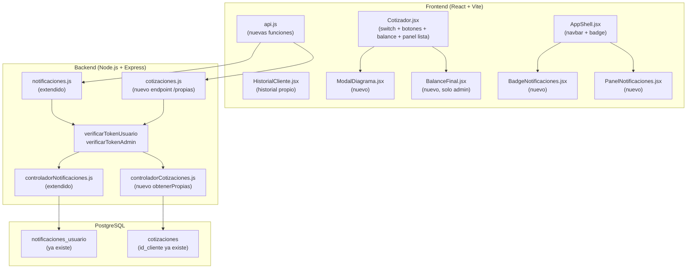

# Diseño Técnico — Mejoras UX, Roles y Notificaciones

## Resumen de investigación

Antes de escribir el diseño se analizó el código existente para garantizar coherencia con los patrones establecidos:

- **Frontend**: React + Tailwind + Vite. Contexto global en `AppContext.jsx` con `usuario`, `esAdmin`, `esUsuario`, `esInvitado`, `margenGanancia`. Servicios centralizados en `frontend/src/servicios/api.js`. Hooks en `frontend/src/hooks/`. Rutas protegidas: `RutaProtegida` (admin), `RutaProtegidaUsuario` (cualquier autenticado).
- **Backend**: Express + PostgreSQL con `ejecutarQuery` / `ejecutarTransaccion`. Middlewares `verificarTokenAdmin`, `verificarTokenUsuario`, `detectarUsuario`. Controladores en `backend/src/controladores/`, rutas en `backend/src/rutas/`. Respuestas estandarizadas: `{ exito: true, ... }` / `{ error, mensaje, codigo }`.
- **Componentes existentes relevantes**: `DiagramaCompatibilidad.jsx` (SVG con nodos y conexiones), `NotificacionToast.jsx` + `NotificacionesToastContainer`, `usePollingNotificaciones` (polling cada 30s), `AppShell.jsx` (layout con sidebar desktop + bottom nav móvil + header sticky).
- **Tabla `notificaciones_usuario`**: ya existe con campos `id`, `id_usuario`, `tipo`, `titulo`, `mensaje`, `leida`, `datos_extra`, `fecha_creacion`.
- **`HistorialCliente.jsx`**: actualmente solo soporta búsqueda por email; no tiene lógica de rol. Usa `consultarHistorialCliente(email)` de `api.js`.
- **`Cotizador.jsx`**: 1979 líneas. El switch de disponibilidad y los botones de navegación están implementados pero con posicionamiento incorrecto. El panel de cotización lista (`SuccessState`) no tiene control de visibilidad por rol.
- **`controladorCotizaciones.js`**: ya inserta notificación en `notificaciones_usuario` al crear cotización para usuarios con rol `usuario`. El campo `id_cliente` en `cotizaciones` se asigna directamente desde el token para usuarios autenticados.
- **`controladorNotificaciones.js`**: ya implementa `obtenerPendientes` y `marcarLeida`. Faltan `obtenerTodas` y `marcarTodasLeidas`.
- **Testing**: `fast-check` ya instalado en backend. Vitest + Testing Library en frontend.

---

## Visión General

Este documento describe el diseño técnico para 6 mejoras del sistema Cotizador NSG. Las mejoras se agrupan en tres capas:

1. **UX del cotizador**: Modal pantalla completa para DiagramaCompatibilidad (Req. 1), corrección del switch y reposición de botones (Req. 2), balance final con % ganancia (Req. 3).
2. **Control de acceso por rol**: Visibilidad en panel cotización lista (Req. 4), historial solo cotizaciones propias (Req. 5).
3. **Sistema de notificaciones**: Badge en navbar + panel de notificaciones (Req. 6).

---

## Arquitectura

### Diagrama de alto nivel



### Principios de diseño

- **Sin cambios de contrato**: Los endpoints existentes no se modifican; solo se agregan nuevos o se extienden con parámetros opcionales.
- **Renderizado condicional estricto**: El control de visibilidad por rol se implementa siempre con renderizado condicional en React (`{esAdmin && <Componente />}`), nunca con CSS `display: none`.
- **Consistencia de patrones**: Nuevos controladores siguen el mismo patrón de `sanitizarObjeto` + consultas parametrizadas + respuestas `{ exito, ... }`.
- **Degradación elegante**: El badge de notificaciones no bloquea la UI si el polling falla.
- **Sin nuevas tablas**: Las 6 mejoras no requieren nuevas tablas de base de datos; usan las existentes.

---

## Componentes e Interfaces

### Nuevos componentes frontend

| Componente | Ruta de archivo | Descripción |
|---|---|---|
| `ModalDiagrama` | `componentes/cotizador/ModalDiagrama.jsx` | Overlay pantalla completa con DiagramaCompatibilidad ampliado |
| `BalanceFinal` | `componentes/cotizador/BalanceFinal.jsx` | Resumen financiero con % ganancia global (solo admin) |
| `BadgeNotificaciones` | `componentes/ui/BadgeNotificaciones.jsx` | Indicador numérico de notificaciones no leídas |
| `PanelNotificaciones` | `componentes/notificaciones/PanelNotificaciones.jsx` | Panel desplegable con historial de notificaciones |

### Modificaciones a componentes existentes

| Componente | Cambio |
|---|---|
| `DiagramaCompatibilidad.jsx` | Agregar botón de expansión (esquina superior derecha) que abre `ModalDiagrama` |
| `Cotizador.jsx` | Reubicar switch y botones; agregar `BalanceFinal`; agregar control de visibilidad en panel lista |
| `HistorialCliente.jsx` | Agregar lógica de rol: carga automática para `usuario`, ocultar campo email, deshabilitar botones |
| `AppShell.jsx` | Agregar `BadgeNotificaciones` y `PanelNotificaciones` en el header |
| `usePollingNotificaciones.js` | Extender para exponer `conteoNoLeidas` además de `notificaciones` |

### Backend — Nuevos endpoints

#### Extensión de `backend/src/rutas/notificaciones.js`
```
GET   /api/notificaciones/todas        →  verificarTokenUsuario  →  obtenerTodas
PATCH /api/notificaciones/leer-todas   →  verificarTokenUsuario  →  marcarTodasLeidas
```

#### Extensión de `backend/src/rutas/cotizaciones.js`
```
GET /api/cotizaciones/propias          →  verificarTokenUsuario  →  obtenerPropias
```

### Backend — Nuevas funciones de controlador

#### `controladorNotificaciones.obtenerTodas(req, res)`
```sql
SELECT id, tipo, titulo, mensaje, leida, fecha_creacion, datos_extra
FROM notificaciones_usuario
WHERE id_usuario = 
ORDER BY fecha_creacion DESC
LIMIT  OFFSET 
```
Parámetros opcionales: `limit` (default 50, máx 100), `offset` (default 0).
Respuesta: `{ exito: true, total: N, notificaciones: [...] }`

#### `controladorNotificaciones.marcarTodasLeidas(req, res)`
```sql
UPDATE notificaciones_usuario
SET leida = true
WHERE id_usuario =  AND leida = false
RETURNING id
```
Respuesta: `{ exito: true, actualizadas: N }`

#### `controladorCotizaciones.obtenerPropias(req, res)`
```sql
SELECT
  c.id, c.codigo_ticket, c.fecha_emision, c.fecha_validez,
  c.precio_total, c.margen_aplicado, c.estado,
  c.subtotal_neto, c.igv_porcentaje, c.igv_monto, c.total_con_igv,
  c.tipo_cambio_referencia, c.subtotal_neto_pen, c.igv_monto_pen, c.total_con_igv_pen,
  n.estado AS notificacion_estado, n.fecha_envio AS notificacion_fecha_envio
FROM cotizaciones c
LEFT JOIN notificaciones_email n ON n.id_cotizacion = c.id
WHERE c.id_cliente = 
ORDER BY c.fecha_emision DESC
```
El `` se obtiene exclusivamente de `req.usuario.id` (token JWT). No acepta parámetros de identificación en query string ni body.
Respuesta: misma estructura que `GET /api/cotizaciones/cliente/:email` para compatibilidad con el frontend existente.

### Extensiones de `api.js`

```javascript
// Notificaciones
export const obtenerTodasNotificaciones = async ({ limit = 50, offset = 0 } = {}) => { ... }
export const marcarTodasNotificacionesLeidas = async () => { ... }

// Cotizaciones propias
export const obtenerCotizacionesPropias = async () => { ... }
```

---

## Modelos de Datos

### Sin nuevas tablas

Las 6 mejoras no requieren nuevas tablas. Se usan las existentes:

- `notificaciones_usuario`: ya tiene todos los campos necesarios (`id`, `id_usuario`, `tipo`, `titulo`, `mensaje`, `leida`, `datos_extra`, `fecha_creacion`).
- `cotizaciones`: el campo `id_cliente` ya existe y ya se asigna desde el token para usuarios autenticados.

### Índice recomendado (si no existe)

```sql
-- Optimiza la consulta de todas las notificaciones de un usuario (paginada)
CREATE INDEX IF NOT EXISTS idx_notificaciones_usuario_todas
  ON notificaciones_usuario (id_usuario, fecha_creacion DESC);
```

Este índice complementa el índice parcial existente `WHERE leida = FALSE` para la consulta de pendientes.

### Estructura de respuesta de `GET /api/cotizaciones/propias`

Para mantener compatibilidad con `HistorialCliente.jsx`, la respuesta debe tener la misma forma que `GET /api/cotizaciones/cliente/:email`:

```json
{
  "exito": true,
  "cliente": {
    "nombre": "Nombre del usuario",
    "email": "correo@ejemplo.com"
  },
  "cotizaciones": [
    {
      "id": 1,
      "codigo_ticket": "NSG-2024-0001",
      "fecha_emision": "2024-01-15T10:30:00Z",
      "fecha_validez": "2024-01-18T10:30:00Z",
      "estado": "Pendiente",
      "precio_total": 1250.00,
      "finanzas": {
        "total": { "usd": 1250.00, "pen": 4687.50 }
      },
      "notificacion": {
        "estado": "enviada",
        "fecha_envio": "2024-01-15T10:30:05Z"
      }
    }
  ]
}
```

---

## Correctness Properties

*Una propiedad es una característica o comportamiento que debe mantenerse verdadero en todas las ejecuciones válidas del sistema — esencialmente, una declaración formal sobre lo que el sistema debe hacer. Las propiedades sirven como puente entre especificaciones legibles por humanos y garantías de corrección verificables por máquina.*

### Reflexión de propiedades (eliminación de redundancias)

Tras el análisis de prework se identificaron las siguientes consolidaciones:

- **Req. 2.1 y 2.2** son la misma propiedad (filtro "disponibles") — se consolidan en Property 1.
- **Req. 4.1, 4.2 y 4.3** son la misma propiedad de control de acceso para distintos roles no-admin — se consolidan en Property 5.
- **Req. 3.2, 3.3 y 3.4** son propiedades matemáticas relacionadas — se consolidan en Property 3 (cálculo del balance).
- **Req. 5.3 y 5.4** son complementarias (ocultar/mostrar campo email según rol) — se consolidan en Property 7.
- **Req. 5.5 y 5.6** son la misma propiedad (botones deshabilitados para rol usuario) — se consolidan en Property 8.
- **Req. 6.2 y 6.4** son propiedades del badge — se consolidan en Property 10.

---

### Property 1: Filtro de disponibilidad es correcto

*Para cualquier* lista de productos con mezcla arbitraria de valores de `stock` y `disponible_a_pedido`, cuando el filtro está en estado "disponibles", todos los productos mostrados deben tener `stock > 0` o `disponible_a_pedido = true`; cuando el filtro está en estado "todos", el resultado debe contener exactamente los mismos productos que la lista original sin ninguna exclusión.

**Validates: Requirements 2.1, 2.2, 2.3**

---

### Property 2: Botones de navegación respetan los límites del paso

*Para cualquier* índice de paso `pasoActual` en el rango `[0, PASOS.length - 1]`, el botón "Anterior" debe estar deshabilitado si y solo si `pasoActual === 0`, y el botón "Siguiente" debe estar deshabilitado si y solo si `pasoActual === PASOS.length - 1`.

**Validates: Requirements 2.8, 2.9**

---

### Property 3: Cálculo del balance financiero es matemáticamente correcto

*Para cualquier* conjunto de productos seleccionados con precios arbitrarios y cualquier valor de `margenGanancia` en el rango `[0, 100]`:
- El costo neto total debe ser igual a la suma exacta de `precio_base × cantidad` de todos los productos.
- El precio de venta total debe ser igual a `costoNeto × (1 + margenGanancia / 100)`.
- El porcentaje de ganancia global debe ser igual a `((precioVenta - costoNeto) / costoNeto) × 100`, redondeado a dos decimales.

**Validates: Requirements 3.2, 3.3, 3.4**

---

### Property 4: Color del porcentaje de ganancia refleja el valor

*Para cualquier* valor de `margenGanancia` mayor a cero, el porcentaje de ganancia debe renderizarse con la clase de color de éxito (`text-[var(--color-success)]` o equivalente). Para `margenGanancia === 0`, debe renderizarse con la clase de color neutro (`text-[var(--color-text-muted)]`).

**Validates: Requirements 3.6, 3.7**

---

### Property 5: Botones administrativos del panel lista son invisibles para usuarios no-admin

*Para cualquier* usuario con `esAdmin === false` (rol `usuario` o invitado), los botones "Ver historial" y "Validar ticket" no deben estar presentes en el DOM del panel de cotización lista. Para cualquier usuario con `esAdmin === true`, ambos botones deben estar presentes en el DOM.

**Validates: Requirements 4.1, 4.2, 4.3**

---

### Property 6: Código ticket y botón PDF son visibles para todos los usuarios

*Para cualquier* usuario (admin, usuario autenticado o invitado), después de generar una cotización exitosa, el código de ticket y el botón de descarga de PDF deben estar presentes en el DOM del panel de cotización lista.

**Validates: Requirements 4.4**

---

### Property 7: Campo de búsqueda por email se muestra según el rol

*Para cualquier* usuario con `esAdmin === true`, el campo de búsqueda por correo electrónico y la lista de clientes registrados deben estar presentes en el DOM de `HistorialCliente`. Para cualquier usuario con `esUsuario === true`, el campo de búsqueda por correo electrónico no debe estar presente en el DOM.

**Validates: Requirements 5.3, 5.4**

---

### Property 8: Botones de acción están deshabilitados para rol usuario

*Para cualquier* usuario con `esUsuario === true`, los botones "Validar", "Técnico" y "Excel" en cada fila de la tabla de cotizaciones deben tener `disabled={true}` y `aria-disabled="true"`.

**Validates: Requirements 5.5, 5.6**

---

### Property 9: Endpoint /propias rechaza acceso a cotizaciones ajenas

*Para cualquier* usuario autenticado con rol `usuario` que intente acceder a `GET /api/cotizaciones/cliente/:email` con un email diferente al suyo, el sistema debe retornar HTTP 403 con código `ACCESO_DENEGADO`.

**Validates: Requirements 5.7**

---

### Property 10: Badge muestra el conteo correcto de notificaciones no leídas

*Para cualquier* número `N` de notificaciones no leídas:
- Si `N === 0`, el badge no debe estar presente en el DOM.
- Si `1 ≤ N ≤ 99`, el badge debe mostrar exactamente el texto `String(N)`.
- Si `N > 99`, el badge debe mostrar exactamente el texto `"99+"`.

**Validates: Requirements 6.2, 6.3, 6.4**

---

### Property 11: Panel de notificaciones renderiza todos los campos de cada notificación

*Para cualquier* notificación con datos arbitrarios (título, mensaje, fecha de creación y estado de lectura), el panel de notificaciones debe renderizar todos esos campos en el DOM para esa notificación.

**Validates: Requirements 6.8**

---

## Manejo de Errores

### Estrategia general

Todos los nuevos endpoints siguen el formato de error estandarizado existente:

```json
{
  "error": "Descripción técnica del error",
  "mensaje": "Mensaje legible para el usuario",
  "codigo": "CODIGO_ERROR_CONSTANTE"
}
```

### Tabla de errores por feature

| Feature | Condición | HTTP | Código |
|---|---|---|---|
| Notificaciones (todas) | Sin token o token inválido | 401 | `NO_AUTORIZADO` |
| Notificaciones (leer-todas) | Sin token o token inválido | 401 | `NO_AUTORIZADO` |
| Cotizaciones propias | Sin token o token inválido | 401 | `NO_AUTORIZADO` |
| Cotizaciones propias | Token válido pero rol `admin` intenta acceder | 200 | Retorna sus propias cotizaciones (admin también puede tener cotizaciones) |
| Historial por email | Usuario con rol `usuario` intenta acceder a email ajeno | 403 | `ACCESO_DENEGADO` |
| Notificaciones (todas) | `limit` fuera de rango `[1, 100]` | 400 | `PARAMETROS_INVALIDOS` |
| Notificaciones (todas) | `offset` negativo | 400 | `PARAMETROS_INVALIDOS` |

### Degradación elegante

- **Badge de notificaciones**: Si el polling falla, el badge mantiene el último conteo conocido. El error se registra en consola sin interrumpir la UI.
- **Panel de notificaciones**: Si `GET /api/notificaciones/todas` falla, se muestra `ErrorState` con botón "Reintentar". El panel no se cierra automáticamente.
- **Carga automática del historial**: Si `GET /api/cotizaciones/propias` falla, se muestra `ErrorState` con botón "Reintentar". No se muestra el formulario de email como fallback (el usuario no debe ver esa UI).
- **ModalDiagrama**: Si el componente `DiagramaCompatibilidad` lanza un error dentro del modal, el modal se cierra y se muestra un toast de error. El diagrama en línea sigue funcionando.

---

## Estrategia de Testing

### Enfoque dual

Se usa una combinación de tests de propiedades con `fast-check` (ya instalado) y tests de componentes con Vitest + Testing Library.

### Tests de propiedades (fast-check)

Cada propiedad del documento se implementa como un test de `fast-check` con mínimo 100 iteraciones.

**Configuración**:
```javascript
fc.assert(fc.property(...), { numRuns: 100 });
```

**Formato de tag en cada test**:
```javascript
// Feature: mejoras-ux-roles-notificaciones, Property N: <texto de la propiedad>
```

**Archivos de tests de propiedades**:
```
frontend/src/__tests__/propiedades/
  filtroDisponibilidad.property.test.js    → Property 1
  botonesNavegacion.property.test.js       → Property 2
  balanceFinal.property.test.js            → Properties 3, 4
  panelCotizacionLista.property.test.js    → Properties 5, 6
  historialCliente.property.test.js        → Properties 7, 8
  badgeNotificaciones.property.test.js     → Properties 10, 11

backend/src/__tests__/propiedades/
  cotizacionesPropias.property.test.js     → Property 9
```

### Tests de integración (Jest + Supertest)

```
backend/src/__tests__/integracion/
  notificaciones.test.js     → GET /todas, PATCH /leer-todas (auth, estructura)
  cotizacionesPropias.test.js → GET /propias (auth, aislamiento de datos)
```

### Tests de componentes (Vitest + Testing Library)

```
frontend/src/__tests__/
  ModalDiagrama.test.jsx          → Apertura, cierre con Escape, foco, ARIA
  BalanceFinal.test.jsx           → Cálculo, colores, aria-live
  BadgeNotificaciones.test.jsx    → Conteo, visibilidad, aria-label
  PanelNotificaciones.test.jsx    → Renderizado, marcar leída, marcar todas, error
  HistorialCliente.test.jsx       → Carga automática, campo email oculto, botones disabled
```

### Cobertura esperada

| Área | Tipo de test | Cobertura objetivo |
|---|---|---|
| Lógica de filtro de disponibilidad | Propiedades (fast-check) | Property 1 |
| Lógica de navegación por pasos | Propiedades (fast-check) | Property 2 |
| Cálculo del balance financiero | Propiedades (fast-check) | Properties 3, 4 |
| Control de visibilidad por rol (UI) | Propiedades (fast-check) | Properties 5, 6, 7, 8 |
| Seguridad del endpoint /propias | Propiedades (fast-check) + Integración | Property 9 |
| Badge de notificaciones | Propiedades (fast-check) | Property 10 |
| Panel de notificaciones | Propiedades (fast-check) + Componente | Property 11 |
| Nuevos endpoints | Integración (Supertest) | Auth + estructura de respuesta |
| Componentes UI nuevos | Componente (Vitest) | Caso feliz + error + accesibilidad |

### Notas sobre PBT y mocks

Los tests de propiedades de frontend usan mocks del contexto `AppContext` para aislar la lógica de renderizado. Los tests de backend usan mocks de `ejecutarQuery` para mantener velocidad y determinismo en las 100+ iteraciones.
