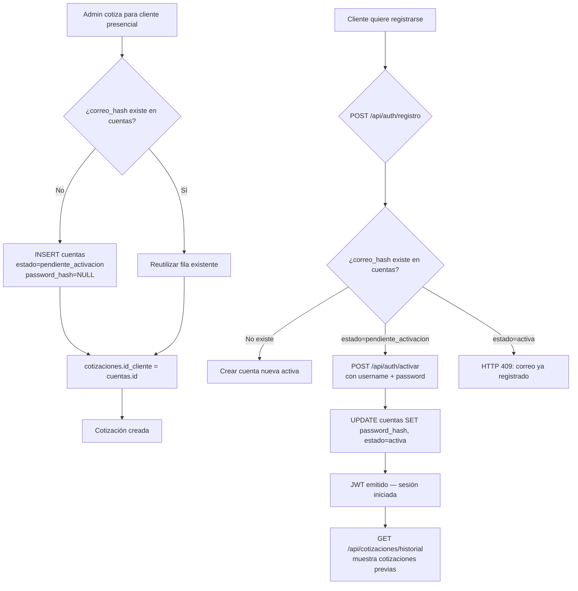
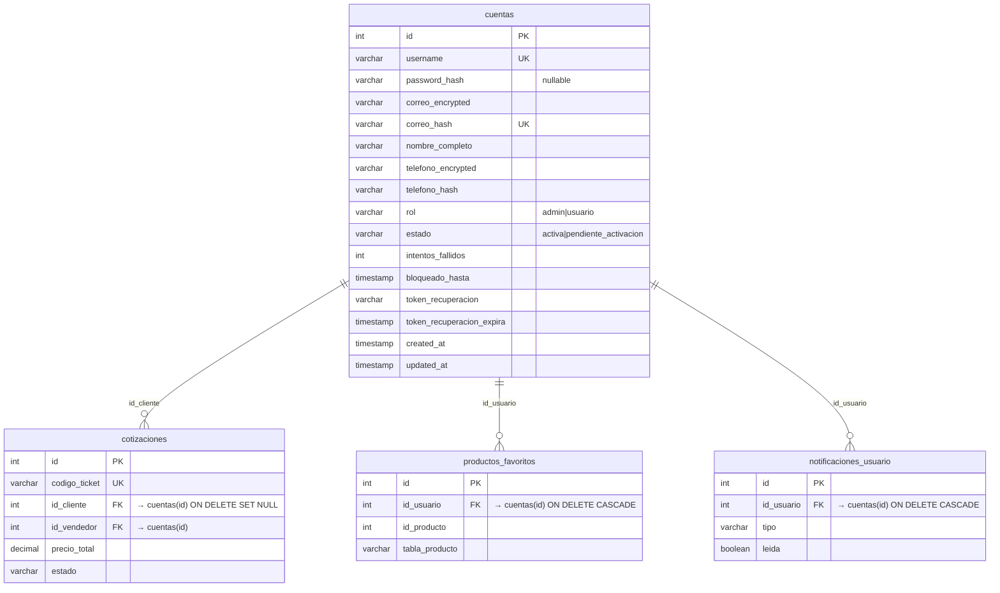

# Diseño Técnico — Unificación de Usuarios en Tabla `cuentas`

## Resumen de investigación

Se analizó el código existente antes de escribir este diseño:

- **`base-datos/schema.sql`**: `usuarios_clientes` tiene `id, nombre, correo (AES-256), correo_hash (HMAC-SHA256), telefono, created_at`. `cotizaciones.id_cliente` referencia `usuarios_clientes(id) ON DELETE SET NULL`.
- **`base-datos/migraciones/004_cuentas_y_roles.sql`**: `cuentas` tiene `password_hash VARCHAR(255) NOT NULL` — actualmente no acepta NULL. No tiene columna `estado`.
- **`backend/src/servicios/servicioAuth.js`**: `login()` busca por `username`, verifica `password_hash` con bcrypt. `registrar()` verifica unicidad de `correo_hash` y retorna `409` si ya existe — este comportamiento debe cambiar para detectar `Cuenta_Pendiente`.
- **`backend/src/middleware/auth.js`**: `verificarTokenUsuario` y `verificarTokenAdmin` solo verifican el JWT; **no consultan BD** para verificar estado de cuenta.
- **`backend/src/controladores/controladorCotizaciones.js`**: 6 puntos de uso de `usuarios_clientes` (buscar, insertar, actualizar, JOIN en obtener, buscar para notificar, listar clientes).
- **`fast-check`**: ya instalado como devDependency en backend.

---

## Visión General

La migración se ejecuta en **4 fases ordenadas** para no romper producción:

1. **Fase 1 — DDL**: Modificar `cuentas` (nullable `password_hash`, agregar `estado`).
2. **Fase 2 — Datos**: Migrar filas de `usuarios_clientes` → `cuentas`, redirigir FK de `cotizaciones`.
3. **Fase 3 — Código**: Actualizar `servicioAuth`, `auth.js`, `controladorCotizaciones` y scripts de features avanzadas.
4. **Fase 4 — Deprecación**: Renombrar `usuarios_clientes` → `usuarios_clientes_deprecated`.

Cada fase es verificable y reversible antes de pasar a la siguiente.

---

## Arquitectura

### Flujo guest-to-registered



### Diagrama de tablas tras la migración



---

## Componentes e Interfaces

### Fase 1 — Migración DDL: `005_unificar_usuarios_cuentas.sql`

```sql
-- ============================================================
-- MIGRACIÓN 005: Unificación usuarios — Fase 1 DDL
-- Hace password_hash nullable y agrega columna estado a cuentas
-- ============================================================
BEGIN;

-- 1. password_hash pasa a ser nullable
ALTER TABLE cuentas
  ALTER COLUMN password_hash DROP NOT NULL;

-- 2. Agregar columna estado
ALTER TABLE cuentas
  ADD COLUMN estado VARCHAR(30) NOT NULL DEFAULT 'activa'
    CHECK (estado IN ('activa', 'pendiente_activacion'));

-- 3. Marcar todas las cuentas existentes como activas (ya tienen password)
UPDATE cuentas SET estado = 'activa' WHERE estado IS DISTINCT FROM 'activa';

-- 4. Índice para filtrado por estado
CREATE INDEX idx_cuentas_estado ON cuentas(estado);

-- 5. username puede ser NULL para cuentas pendientes (clientes sin username elegido)
ALTER TABLE cuentas
  ALTER COLUMN username DROP NOT NULL;

-- Nota: username sigue siendo UNIQUE cuando no es NULL (constraint existente lo garantiza)

COMMIT;
```

> **Decisión de diseño**: `username` pasa a nullable porque los clientes presenciales no eligen un username — solo tienen correo. El constraint UNIQUE existente en PostgreSQL ignora valores NULL, por lo que múltiples cuentas pendientes sin username no generan conflicto.

---

### Fase 2 — Script migrador: `backend/scripts/migrar-005-unificar-usuarios.js`

```javascript
/**
 * Migrador 005 — Unificación usuarios_clientes → cuentas
 *
 * Uso:
 *   node migrar-005-unificar-usuarios.js
 *   node migrar-005-unificar-usuarios.js --rollback
 *   node migrar-005-unificar-usuarios.js --confirmar-produccion  (entorno prod)
 *
 * Pasos:
 *   1. Contar filas en usuarios_clientes
 *   2. Por cada fila en usuarios_clientes:
 *      a. Si correo_hash ya existe en cuentas → registrar mapeo id_uc → id_cuenta
 *      b. Si no existe → INSERT en cuentas con estado='pendiente_activacion'
 *   3. UPDATE cotizaciones SET id_cliente = nuevo_id WHERE id_cliente = id_uc_original
 *   4. Verificar conteo: filas migradas == filas originales
 *   5. Cambiar FK cotizaciones.id_cliente → cuentas(id)
 *   6. Renombrar usuarios_clientes → usuarios_clientes_deprecated
 *   7. Verificar que ninguna FK activa apunte a usuarios_clientes_deprecated
 */

async function migrar(cliente) {
  // Paso 1: contar
  const { rows: [{ total }] } = await cliente.query(
    'SELECT COUNT(*) AS total FROM usuarios_clientes'
  );
  console.log(`[005] Clientes a migrar: ${total}`);

  // Paso 2: migrar filas
  const { rows: clientesOriginales } = await cliente.query(
    'SELECT id, nombre, correo, correo_hash, telefono FROM usuarios_clientes'
  );

  const mapaIds = new Map(); // id_uc → id_cuenta

  for (const uc of clientesOriginales) {
    // Verificar si correo_hash ya existe en cuentas
    const { rows: existente } = await cliente.query(
      'SELECT id FROM cuentas WHERE correo_hash = $1',
      [uc.correo_hash]
    );

    if (existente.length > 0) {
      // Reutilizar cuenta existente
      mapaIds.set(uc.id, existente[0].id);
      console.log(`[005] Correo ya existe en cuentas → reutilizando id=${existente[0].id}`);
    } else {
      // Generar username único: 'guest_' + primeros 16 chars del correo_hash
      const username = uc.correo_hash
        ? `guest_${uc.correo_hash.substring(0, 16)}`
        : null;

      const { rows: [nueva] } = await cliente.query(
        `INSERT INTO cuentas
           (username, password_hash, correo_encrypted, correo_hash,
            nombre_completo, telefono_encrypted, rol, estado, created_at)
         VALUES ($1, NULL, $2, $3, $4, $5, 'usuario', 'pendiente_activacion', NOW())
         RETURNING id`,
        [username, uc.correo, uc.correo_hash, uc.nombre || 'Cliente', uc.telefono]
      );
      mapaIds.set(uc.id, nueva.id);
    }
  }

  // Paso 3: redirigir cotizaciones
  for (const [idUc, idCuenta] of mapaIds) {
    await cliente.query(
      'UPDATE cotizaciones SET id_cliente = $1 WHERE id_cliente = $2',
      [idCuenta, idUc]
    );
  }

  // Paso 4: verificar conteo
  const { rows: [{ migradas }] } = await cliente.query(
    "SELECT COUNT(*) AS migradas FROM cuentas WHERE estado = 'pendiente_activacion'"
  );
  // Nota: migradas >= total (puede haber más si ya existían pendientes de antes)
  console.log(`[005] Verificación: ${total} originales, ${migradas} pendientes en cuentas`);

  // Paso 5: cambiar FK cotizaciones.id_cliente
  await cliente.query(`
    ALTER TABLE cotizaciones
      DROP CONSTRAINT IF EXISTS cotizaciones_id_cliente_fkey;
    ALTER TABLE cotizaciones
      ADD CONSTRAINT cotizaciones_id_cliente_fkey
      FOREIGN KEY (id_cliente) REFERENCES cuentas(id) ON DELETE SET NULL;
  `);

  // Paso 6: renombrar tabla
  await cliente.query(
    'ALTER TABLE usuarios_clientes RENAME TO usuarios_clientes_deprecated'
  );
  await cliente.query(`
    COMMENT ON TABLE usuarios_clientes_deprecated IS
    'DEPRECADA ${new Date().toISOString().split('T')[0]} — migrada a tabla cuentas (migración 005)';
  `);

  // Paso 7: verificar que no queden FKs activas
  const { rows: fksActivas } = await cliente.query(`
    SELECT conname FROM pg_constraint
    WHERE confrelid = 'usuarios_clientes_deprecated'::regclass
      AND contype = 'f'
  `);
  if (fksActivas.length > 0) {
    throw new Error(`FKs activas apuntan a usuarios_clientes_deprecated: ${fksActivas.map(r => r.conname).join(', ')}`);
  }

  console.log('[005] Migración completada exitosamente.');
}
```

---

### Fase 3 — Cambios en `servicioAuth.js`

#### `login()` — agregar verificación de estado

```javascript
// ANTES (línea ~40):
const resultado = await ejecutarQuery(
  `SELECT id, username, password_hash, nombre_completo, rol,
          intentos_fallidos, bloqueado_hasta
   FROM cuentas WHERE username = $1`,
  [username]
);

// DESPUÉS — agregar estado al SELECT:
const resultado = await ejecutarQuery(
  `SELECT id, username, password_hash, nombre_completo, rol,
          estado, intentos_fallidos, bloqueado_hasta
   FROM cuentas WHERE username = $1`,
  [username]
);

// Agregar verificación ANTES de bcrypt.compare:
if (cuenta.estado === 'pendiente_activacion') {
  return {
    exito: false,
    status: 403,
    error: 'Cuenta no activada',
    mensaje: 'Debes activar tu cuenta antes de iniciar sesión',
    codigo: 'CUENTA_PENDIENTE'
  };
}
```

#### `registrar()` — detectar Cuenta_Pendiente en lugar de retornar 409

```javascript
// ANTES (línea ~145):
if (correoExiste.rows.length > 0) {
  return { exito: false, status: 409, error: 'El correo electrónico ya está registrado' };
}

// DESPUÉS:
if (correoExiste.rows.length > 0) {
  const cuentaExistente = correoExiste.rows[0];
  if (cuentaExistente.estado === 'pendiente_activacion') {
    // Señalizar al frontend que debe redirigir al flujo de activación
    return {
      exito: false,
      status: 409,
      error: 'Correo con cuenta pendiente de activación',
      codigo: 'CUENTA_PENDIENTE_ACTIVACION',
      mensaje: 'Este correo ya tiene cotizaciones asociadas. Activa tu cuenta para acceder a ellas.'
    };
  }
  return { exito: false, status: 409, error: 'El correo electrónico ya está registrado' };
}
```

#### Nueva función `activarCuenta()`

```javascript
/**
 * Activa una Cuenta_Pendiente estableciendo username y contraseña.
 *
 * @param {Object} datos - { correo, username, password, confirmarPassword }
 * @returns {Promise<Object>}
 */
async function activarCuenta(datos) {
  // 1. Validar inputs (password >= 8 chars, username requerido)
  // 2. Buscar cuenta por correo_hash con estado='pendiente_activacion'
  // 3. Si no existe → { exito: false, status: 404, error: 'Cuenta no encontrada' }
  // 4. Verificar unicidad de username en cuentas
  // 5. hashPassword(datos.password)
  // 6. UPDATE cuentas SET password_hash=$1, username=$2, estado='activa',
  //                       intentos_fallidos=0, bloqueado_hasta=NULL
  //    WHERE correo_hash=$3 AND estado='pendiente_activacion'
  // 7. Generar JWT y retornar { exito: true, token, usuario }
}
```

---

### Fase 3 — Cambios en `auth.js`

#### `verificarTokenUsuario()` — verificar estado en BD

```javascript
// Agregar consulta a BD después de decodificar el token:
async function verificarTokenUsuario(req, res, next) {
  const token = extraerToken(req);
  if (!token) { /* ... 401 ... */ }

  try {
    const decoded = decodificarToken(token);

    // NUEVO: verificar estado actual en BD (previene uso de tokens de cuentas pendientes)
    const { rows } = await ejecutarQuery(
      'SELECT estado FROM cuentas WHERE id = $1',
      [decoded.id]
    );
    if (rows.length === 0 || rows[0].estado !== 'activa') {
      return res.status(403).json({
        error: 'Cuenta no activada',
        mensaje: 'Debes activar tu cuenta antes de acceder a este recurso'
      });
    }

    req.usuario = { id: decoded.id, username: decoded.username, nombre: decoded.nombre };
    req.rol = decoded.rol;
    next();
  } catch (error) { /* ... manejo existente ... */ }
}
```

> **Nota**: `verificarTokenAdmin` no necesita este cambio porque los admins siempre tienen `estado='activa'` (fueron migrados desde `administradores` con password existente).

---

### Fase 3 — Cambios en `controladorCotizaciones.js`

Los 6 puntos de uso de `usuarios_clientes` se reemplazan así:

| Punto | Query actual | Query nueva |
|---|---|---|
| Buscar cliente | `SELECT id, nombre, telefono FROM usuarios_clientes WHERE correo_hash = $1` | `SELECT id, nombre_completo AS nombre, telefono_encrypted AS telefono FROM cuentas WHERE correo_hash = $1` |
| Actualizar datos | `UPDATE usuarios_clientes SET nombre=$1... WHERE id=$N` | `UPDATE cuentas SET nombre_completo=$1... WHERE id=$N` |
| Insertar cliente | `INSERT INTO usuarios_clientes (nombre, correo, correo_hash, telefono)` | `INSERT INTO cuentas (nombre_completo, correo_encrypted, correo_hash, telefono_encrypted, rol, estado, password_hash) VALUES (..., 'usuario', 'pendiente_activacion', NULL)` |
| JOIN en obtener | `LEFT JOIN usuarios_clientes uc ON uc.id = c.id_cliente` | `LEFT JOIN cuentas uc ON uc.id = c.id_cliente` |
| Buscar para notificar | `SELECT id, nombre FROM usuarios_clientes WHERE correo_hash = $1` | `SELECT id, nombre_completo AS nombre FROM cuentas WHERE correo_hash = $1` |
| Listar clientes | `FROM usuarios_clientes uc LEFT JOIN cotizaciones c ON c.id_cliente = uc.id` | `FROM cuentas uc LEFT JOIN cotizaciones c ON c.id_cliente = uc.id WHERE uc.rol = 'usuario'` |

---

### Fase 3 — Nuevo endpoint `POST /api/auth/activar`

```
POST /api/auth/activar
Body: { correo, username, password, confirmarPassword }
→ servicioAuth.activarCuenta()
→ HTTP 200: { exito: true, token, usuario }
→ HTTP 400: contraseña inválida o username inválido
→ HTTP 404: cuenta pendiente no encontrada para ese correo
→ HTTP 409: username ya en uso
```

Agregar en `backend/src/rutas/auth.js`:
```javascript
router.post('/activar', controladorAuth.activarCuenta);
```

---

### Fase 3 — Actualizar scripts de features avanzadas

En `migrar-features-avanzadas-02-favoritos.js` y `migrar-features-avanzadas-03-notificaciones.js`, cambiar:

```sql
-- ANTES:
REFERENCES usuarios_clientes(id) ON DELETE CASCADE

-- DESPUÉS:
REFERENCES cuentas(id) ON DELETE CASCADE
```

---

## Modelos de Datos

### Esquema final de `cuentas`

```sql
CREATE TABLE cuentas (
  id                        SERIAL PRIMARY KEY,
  username                  VARCHAR(50) UNIQUE,              -- nullable para cuentas pendientes
  password_hash             VARCHAR(255),                    -- nullable para cuentas pendientes
  correo_encrypted          VARCHAR(300),                    -- AES-256-CBC
  correo_hash               VARCHAR(64) UNIQUE,              -- HMAC-SHA256 para búsqueda
  nombre_completo           VARCHAR(100) NOT NULL,
  telefono_encrypted        VARCHAR(100),                    -- AES-256-CBC (opcional)
  telefono_hash             VARCHAR(64),
  rol                       VARCHAR(20) NOT NULL DEFAULT 'usuario'
                              CHECK (rol IN ('admin', 'usuario')),
  estado                    VARCHAR(30) NOT NULL DEFAULT 'activa'
                              CHECK (estado IN ('activa', 'pendiente_activacion')),
  intentos_fallidos         INTEGER NOT NULL DEFAULT 0,
  bloqueado_hasta           TIMESTAMP,
  token_recuperacion        VARCHAR(255),
  token_recuperacion_expira TIMESTAMP,
  created_at                TIMESTAMP NOT NULL DEFAULT CURRENT_TIMESTAMP,
  updated_at                TIMESTAMP NOT NULL DEFAULT CURRENT_TIMESTAMP
);

-- Índices
CREATE INDEX idx_cuentas_correo_hash   ON cuentas(correo_hash);
CREATE INDEX idx_cuentas_rol           ON cuentas(rol);
CREATE INDEX idx_cuentas_telefono_hash ON cuentas(telefono_hash);
CREATE INDEX idx_cuentas_estado        ON cuentas(estado);
```

### FK actualizada en `cotizaciones`

```sql
-- Eliminar FK antigua (apuntaba a usuarios_clientes)
ALTER TABLE cotizaciones
  DROP CONSTRAINT IF EXISTS cotizaciones_id_cliente_fkey;

-- Nueva FK apunta a cuentas
ALTER TABLE cotizaciones
  ADD CONSTRAINT cotizaciones_id_cliente_fkey
  FOREIGN KEY (id_cliente) REFERENCES cuentas(id) ON DELETE SET NULL;
```

---

## Correctness Properties

### Property 1: Login con Cuenta_Pendiente siempre retorna 403

*Para cualquier* cuenta con `estado = 'pendiente_activacion'` y cualquier combinación de `username`/`password`, la función `login()` debe retornar `{ exito: false, status: 403, codigo: 'CUENTA_PENDIENTE' }`.

**Validates: Requisito 7.1, 7.3**

---

### Property 2: Activación con contraseña válida siempre cambia estado a `'activa'`

*Para cualquier* Cuenta_Pendiente y cualquier contraseña de longitud ≥ 8 caracteres, después de llamar a `activarCuenta()` exitosamente, la fila en `cuentas` debe tener `estado = 'activa'` y `password_hash` no nulo.

**Validates: Requisito 5.3**

---

### Property 3: Cotización con correo nuevo crea exactamente una Cuenta_Pendiente

*Para cualquier* correo que no existe en `cuentas`, después de `POST /api/cotizaciones` con ese correo, debe existir exactamente una fila en `cuentas` con `correo_hash` correspondiente y `estado = 'pendiente_activacion'`.

**Validates: Requisito 4.2**

---

### Property 4: Cotización con correo existente nunca duplica filas en `cuentas`

*Para cualquier* correo que ya existe en `cuentas` (sea `activa` o `pendiente_activacion`), después de `POST /api/cotizaciones` con ese correo, el número de filas en `cuentas` con ese `correo_hash` debe seguir siendo exactamente 1.

**Validates: Requisito 4.3**

---

### Property 5: Historial post-activación incluye cotizaciones pre-activación

*Para cualquier* secuencia de N cotizaciones creadas cuando la cuenta tenía `estado = 'pendiente_activacion'`, después de activar la cuenta, `GET /api/cotizaciones/historial` debe retornar exactamente esas N cotizaciones (más cualquier cotización posterior).

**Validates: Requisito 6.1**

---

### Property 6: El migrador preserva el conteo de clientes

*Para cualquier* estado de la tabla `usuarios_clientes` con N filas donde todos los `correo_hash` son únicos y no existen en `cuentas`, después de ejecutar el migrador, el número de nuevas filas en `cuentas` con `estado = 'pendiente_activacion'` debe ser exactamente N.

**Validates: Requisito 2.4**

---

### Property 7: `verificarTokenUsuario` rechaza tokens de cuentas pendientes

*Para cualquier* token JWT válido (firma correcta, no expirado) cuyo `id` corresponde a una cuenta con `estado = 'pendiente_activacion'` en BD, el middleware debe retornar HTTP 403 sin llamar a `next()`.

**Validates: Requisito 7.4**

---

## Manejo de Errores

| Endpoint | Condición | HTTP | Código |
|---|---|---|---|
| `POST /api/auth/login` | Cuenta con `estado='pendiente_activacion'` | 403 | `CUENTA_PENDIENTE` |
| `POST /api/auth/registro` | Correo con cuenta pendiente | 409 | `CUENTA_PENDIENTE_ACTIVACION` |
| `POST /api/auth/registro` | Correo con cuenta activa | 409 | `CORREO_YA_REGISTRADO` |
| `POST /api/auth/activar` | Cuenta pendiente no encontrada | 404 | `CUENTA_NO_ENCONTRADA` |
| `POST /api/auth/activar` | Contraseña < 8 caracteres | 400 | `PASSWORD_INVALIDO` |
| `POST /api/auth/activar` | Username ya en uso | 409 | `USERNAME_EN_USO` |
| `POST /api/cotizaciones` | Email con formato inválido | 400 | `DATOS_CLIENTE_INVALIDOS` |
| Cualquier ruta protegida | Token de cuenta pendiente | 403 | `CUENTA_NO_ACTIVADA` |
| Migrador | FK activa apunta a tabla deprecated | — | Error fatal, rollback automático |

---

## Estrategia de Testing

### Tests de propiedades (fast-check)

```
backend/src/__tests__/propiedades/
  unificacionUsuarios.property.test.js  → Properties 1–7
```

Cada propiedad usa mocks de `ejecutarQuery` para velocidad y determinismo. Mínimo 100 iteraciones.

### Tests de integración (Jest + Supertest)

```
backend/src/__tests__/integracion/
  auth.unificacion.test.js
    → login con Cuenta_Pendiente → 403
    → login con Cuenta_Activa → 200 + token
    → registro con correo pendiente → 409 + codigo CUENTA_PENDIENTE_ACTIVACION
    → registro con correo activo → 409
    → activar cuenta → 200 + token + estado='activa'
    → activar con password corta → 400

  cotizaciones.unificacion.test.js
    → POST /cotizaciones con correo nuevo → crea Cuenta_Pendiente
    → POST /cotizaciones con correo existente → reutiliza cuenta
    → POST /cotizaciones sin correo → id_cliente=NULL
    → GET /cotizaciones/:ticket → JOIN con cuentas retorna cliente_nombre
    → GET /cotizaciones/historial → usuario ve sus cotizaciones pre y post activación

  migrador.unificacion.test.js
    → migrar N filas → N filas pendientes en cuentas
    → migrar con correo duplicado → reutiliza cuenta existente
    → rollback → restaura estado previo
```

### Cobertura esperada

| Área | Tipo | Objetivo |
|---|---|---|
| Lógica de negocio auth | Propiedades (fast-check) | Properties 1–7 |
| Endpoints auth + cotizaciones | Integración (Supertest) | Caso feliz + errores principales |
| Migrador | Integración (BD test) | Conteo, duplicados, rollback |

---

## Plan de Migración por Fases

### Orden de ejecución seguro

```
Fase 1: Ejecutar 005_unificar_usuarios_cuentas.sql (DDL)
        → Verificar: cuentas tiene columna estado, password_hash es nullable
        → Sin downtime: ALTER TABLE es no destructivo

Fase 2: Ejecutar migrar-005-unificar-usuarios.js
        → Verificar: conteo de filas migradas == filas en usuarios_clientes
        → Verificar: cotizaciones.id_cliente apunta a cuentas
        → Verificar: usuarios_clientes_deprecated existe y no tiene FKs activas

Fase 3: Deploy del código actualizado
        → servicioAuth.js (login + registrar + activarCuenta)
        → auth.js (verificarTokenUsuario con check de estado)
        → controladorCotizaciones.js (6 queries actualizadas)
        → rutas/auth.js (nuevo endpoint /activar)
        → migrar-features-avanzadas-02-favoritos.js (FK → cuentas)
        → migrar-features-avanzadas-03-notificaciones.js (FK → cuentas)

Fase 4: Ejecutar tests de regresión completos
        → Si pasan: migración completada
        → Si fallan: rollback disponible en migrar-005-unificar-usuarios.js --rollback
```

> **Nota de producción**: ejecutar `node migrar-005-unificar-usuarios.js --confirmar-produccion` para el paso de renombrado de tabla. Sin este flag, el script se detiene antes del renombrado para permitir validación manual.
